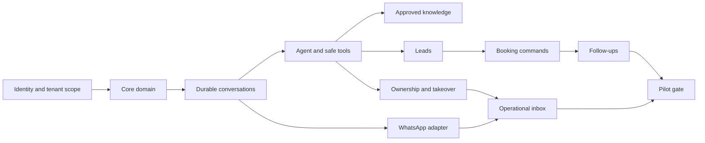

# Dependency map

Security, trace capture, deterministic tests and durable outbox behavior begin in foundation and progress with every phase. Phase 13 validates them under production conditions; it does not introduce them for the first time. WhatsApp discovery starts P00; external activation waits for booking and takeover controls. See [master plan](../14-roadmap/master-plan.md) for precise dependencies and milestone cuts.
