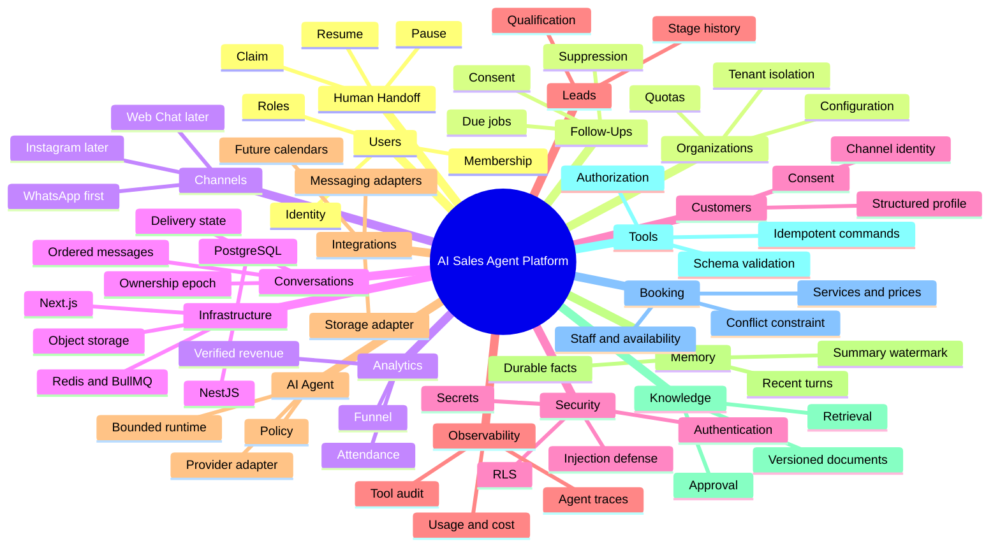

# System mind map

```mermaid
mindmap
  root((AI Sales Agent Platform))
    Users
      Identity
      Membership
      Roles
    Organizations
      Configuration
      Tenant isolation
      Quotas
    Channels
      WhatsApp first
      Instagram later
      Web Chat later
    Conversations
      Ordered messages
      Ownership epoch
      Delivery state
    Customers
      Channel identity
      Consent
      Structured profile
    Leads
      Qualification
      Stage history
    AI Agent
      Bounded runtime
      Provider adapter
      Policy
    Memory
      Recent turns
      Summary watermark
      Durable facts
    Knowledge
      Approval
      Versioned documents
      Retrieval
    Tools
      Schema validation
      Authorization
      Idempotent commands
    Booking
      Services and prices
      Staff and availability
      Conflict constraint
    Human Handoff
      Pause
      Claim
      Resume
    Follow-Ups
      Consent
      Due jobs
      Suppression
    Analytics
      Funnel
      Attendance
      Verified revenue
    Infrastructure
      Next.js
      NestJS
      PostgreSQL
      Redis and BullMQ
      Object storage
    Security
      Authentication
      RLS
      Secrets
      Injection defense
    Observability
      Agent traces
      Tool audit
      Usage and cost
    Integrations
      Messaging adapters
      Storage adapter
      Future calendars
```

The map describes capability boundaries, not separate services. Follow the [dependency map](dependency-map.md) for build order.
