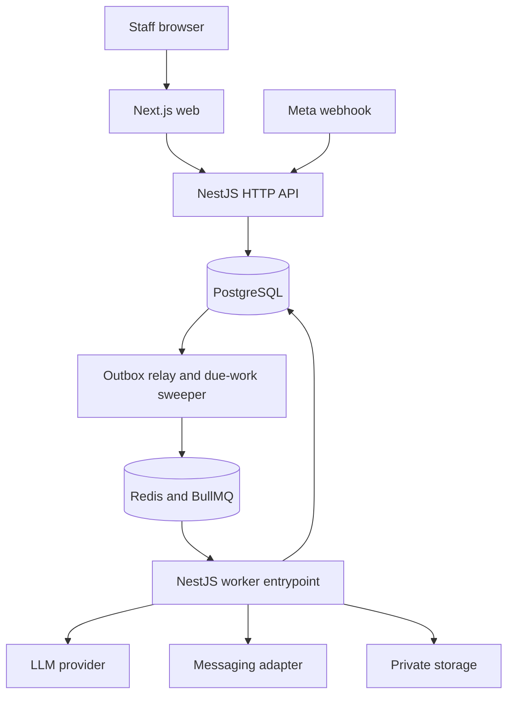

# Container architecture

Use one TypeScript workspace, one backend modular-monolith codebase and schema. API and worker are separate process entrypoints for scaling and failure isolation, not independently owned microservices. PostgreSQL holds durable job intent; Redis accelerates scheduling and is rebuildable.

Likely implementation locations: `apps/web`, `apps/api`, `apps/worker`, `packages/contracts`, `packages/config`, `prisma`, and `tests`. These do not exist yet. Avoid a generic shared utility package until a real consumer boundary requires it. Deploy long-running workers on a container host; do not depend on request-lifetime serverless execution for queues.
