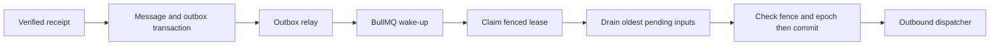

# Queue and conversation concurrency

## Durable ordering authority

BullMQ delivers wake-up jobs; it does not establish per-conversation FIFO correctness. During inbound persistence, lock the conversation row briefly and allocate a monotonically increasing ingress sequence. A unique constraint on conversation and sequence defines accepted order. Store provider event time separately; late messages append with a late flag, never rewrite committed history. Provider delivery order cannot be reconstructed perfectly.

## Worker ownership

Acquire a PostgreSQL-backed conversation lease with owner ID, expiry and incrementing fence using an atomic conditional update. Proposed lease 60 seconds, renew every 15 seconds using database time. Process the oldest pending sequence and coalesce only a contiguous snapshot. Every tool mutation and response commit locks/checks the conversation row, lease validity, fence and ownership epoch. A stale worker cannot commit even if it continues computing after expiry. Do not keep a database transaction open while calling a model.

A newer message arriving during generation invalidates the final response watermark; discard that draft and schedule a new run including durable tool results already committed. Cap two automatic regenerations for a burst, then pause/escalate to avoid spend loops. Mark input processed only with a terminal run decision; failures remain pending or explicitly quarantined.

Queues: conversation, outbound, knowledge-ingest, followup, summary, analytics and maintenance. Work payloads carry tenant ID plus record IDs, not raw conversations or secrets. Workers re-resolve tenant and record authorization. Enforce per-tenant concurrent-run and provider-rate budgets to prevent noisy-neighbor starvation.

Relay marks publication after queue acceptance; duplicates are safe. A periodic database sweeper recovers unpublished outbox rows, expired leases and due durable work, including after Redis loss. Bounded attempts, exponential jitter, dead-letter records and operator replay controls are specified in [failure handling](../04-agent/failure-handling.md). Source: [BullMQ repeated-work guidance](https://docs.bullmq.io/patterns/idempotent-jobs).
