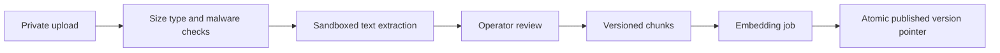
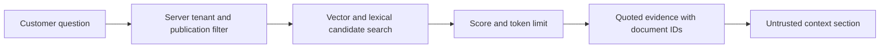

# Knowledge ingestion and retrieval

Start with text/PDF documents and manually entered FAQs, not crawling URLs. Proposed caps: 10 MB/file, 100 pages, 100 documents/tenant; parser time limit 60 seconds. Validate actual media type; isolate parsers and deny network. Failed files stay unpublished with a safe error. Review content before activation; treat embedded instructions as data.

Chunk approximately 500 tokens with 75-token overlap as a tuning baseline. Persist document version, chunk index, content hash, embedding model/dimension and publication state. Re-ingestion creates a new version; publish only after all chunks are ready and atomically deactivate prior retrieval visibility. Deletion immediately removes visibility and schedules blob/vector cleanup.

Retrieve a maximum of six chunks within the context budget, scoped to tenant and published versions in SQL. Tune a minimum relevance threshold against bilingual fixtures; empty/weak evidence triggers clarification or handoff. Start exact vector search for pilot sizes; benchmark approximate indexing before adoption because tenant filters and recall interact. [pgvector reference](https://github.com/pgvector/pgvector).

Prices, hours, slots, customer facts and bookings must come from relational tools even if a document mentions them. Reject or flag conflicting structured facts during publication. See [evaluation](../04-agent/evaluation-strategy.md).
