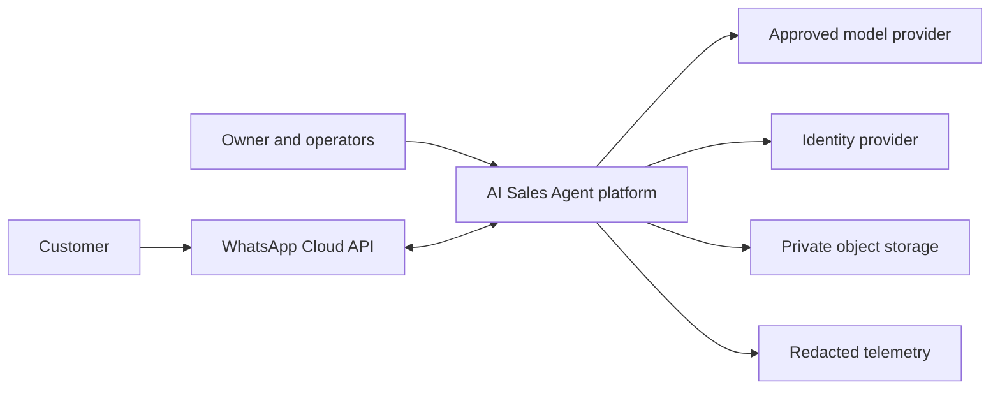

# System context

The platform owns tenant data, business rules, conversation state and command execution. Meta owns transport delivery; model providers produce proposals; neither is the business source of truth. Identity-provider assertions are mapped to local users and memberships before authorization.

Trust boundaries: public webhooks, authenticated staff browser, worker execution, provider outbound requests, object uploads, and telemetry export. Each boundary validates provenance and minimizes PII. Clinical systems, payments and external calendars remain outside MVP. See [security](security-architecture.md).
