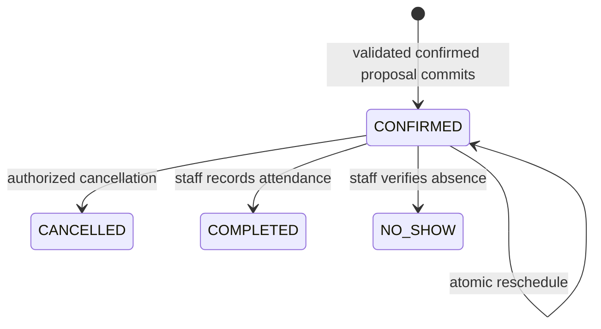

# Booking state machine and conflicts

Slot offers are not reservations and are not Booking rows. A successful createBooking transaction commits CONFIRMED directly after explicit customer confirmation. State changes require current version and authority; cancelled/completed bookings are terminal in MVP, corrections are audited operator actions rather than hidden history edits.

For one-resource appointments, enforce a PostgreSQL exclusion constraint conceptually on (organization_id equality, staff_id equality, occupied UTC range overlap), restricted to CONFIRMED rows. Use half-open ranges [start,end), including service buffers. This is the final conflict authority even when two customers saw the same slot. Confirm extension support and custom migration syntax in P00/P07. [PostgreSQL reference](https://www.postgresql.org/docs/15/rangetypes.html).

Availability combines location hours, staff working hours, service eligibility, overrides, buffers, lead time and existing allocations. Lock a staff schedule row for both schedule edits and booking commands; revalidate within the same transaction so a concurrent hours change cannot invalidate a newly accepted booking unnoticed. Staff-hours edits that conflict with existing bookings return conflict for operator resolution.

Reschedule validates the replacement and updates the same booking atomically; rollback preserves the original slot on conflict. Cancellation checks tenant/customer binding, version and policy; no refund/payment side effects exist. Record immutable service/price/duration snapshots and timezone. Failed sends do not cancel a valid booking; operators see delivery failures separately. [Booking integration](../05-integrations/calendar-booking.md).
