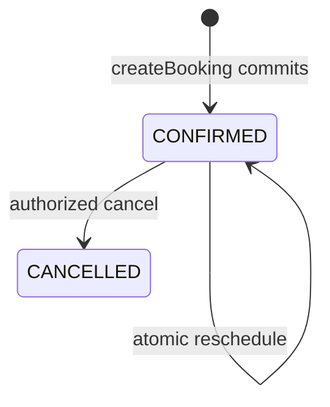

# Booking state machine (P07)

No COMPLETED/NO_SHOW/WON in P07.

Slot offers are not bookings. `slotToken` proves backend generation only.

Occupied range (buffers) is the conflict unit; appointment interval is customer-facing duration only.

Half-open `[start,end)` allows adjacent slots.
