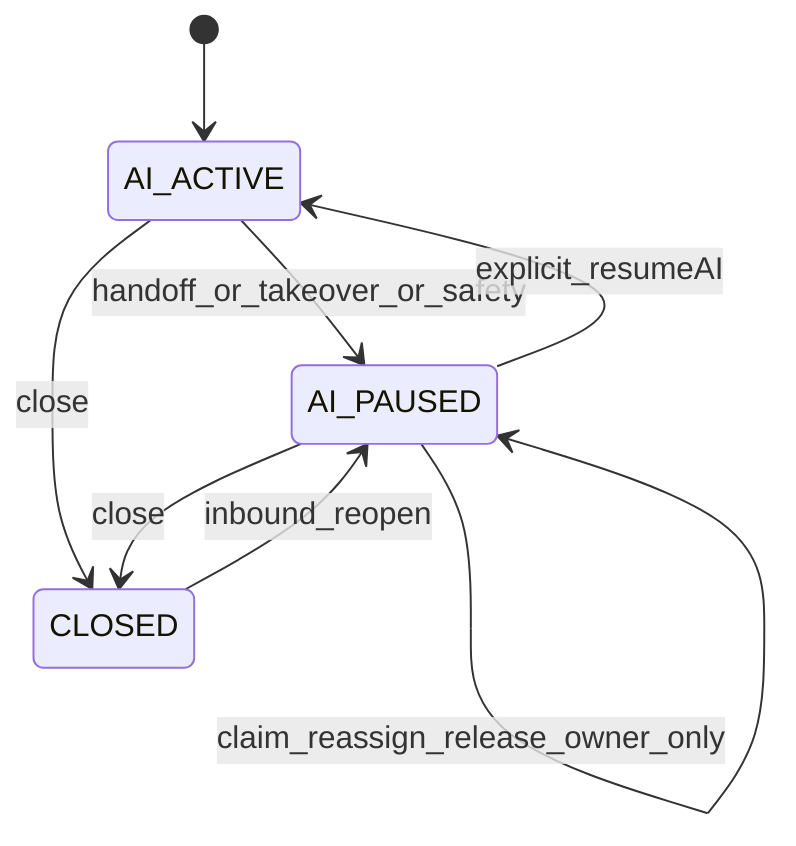

# Conversation ownership state machine

## Canonical modes (P09)

| Mode | Meaning |
|------|---------|
| `AI_ACTIVE` | Autonomous agent may process eligible inbound |
| `AI_PAUSED` | Human control plane; optional `owner_member_id` assignment |
| `CLOSED` | Terminal until inbound reopen |
| `HUMAN_ACTIVE` | **Legacy / reserved** — never transitioned by P09; treat as non-AI |

New conversations start `AI_ACTIVE` when automation is enabled. Closed threads receiving new inbound reopen `AI_PAUSED` so a prior safety or human decision is not silently undone.

Human-owned MVP state is **`AI_PAUSED` + non-null `owner_member_id`**. Unassigned pause/handoff is `AI_PAUSED` + null owner. Release clears owner and **remains** `AI_PAUSED` (no auto AI).

Every control transition increments `ownership_epoch`, checks `expectedOwnershipEpoch`, writes actor/reason audit, and suppresses pending AI outbound from older epochs. Admin reassignment increments epoch. Member removal should clear/pause owned conversations. Timeout/offline status never automatically resumes AI.

## AI eligibility cursor

`ai_eligible_after_sequence` is the resume / human-handled boundary. Only inbound with `ingress_sequence > ai_eligible_after_sequence` may start an autonomous AgentRun when `mode = AI_ACTIVE`. Paused-period messages remain in history/context but are not individually replayed. Do not reuse `processed_sequence` for this boundary.

On `resumeAI`, under the conversation row lock: set `ai_eligible_after_sequence` to the latest ingress watermark (or `0` if none), clear owner, set `AI_ACTIVE`, bump epoch. If no newer inbound exists, resume only changes mode; the next customer message triggers a run.

## Send race / authority epoch

Every autonomous AI outbound Message persists `authority_epoch = conversation.ownership_epoch` at create. Dispatcher atomically checks mode + epoch and marks `DISPATCHING` before provider I/O. Takeover suppresses `PENDING` AI intents and prevents new AI dispatch claims under a stale epoch. An already `DISPATCHING` request may reach the provider after takeover; it cannot reliably be recalled. The inbox must display that in-flight exception. On API uncertainty, classify `UNKNOWN` and reconcile.

`SYSTEM` handoff acknowledgements may dispatch while `AI_PAUSED`. `OPERATOR` replies may dispatch while `AI_PAUSED` subject to channel care-window rules.

## Handoff

`handoffToHuman` is a terminal control transaction: checks fence/epoch, pauses and increments epoch, records pause metadata, marks the triggering input handled as escalated, writes notification intent together. A fixed handoff acknowledgement may be created in that same transaction as `SYSTEM` outbound with `authority_epoch` stamped. It cannot contain arbitrary model text and still obeys channel eligibility.

## Public API

Do not expose arbitrary mode mutation. Production callers use explicit operations: takeover, claim, reassign, release, resumeAI, and established close/reopen rules.

[Conversation API](../07-api/conversation-api.md).
