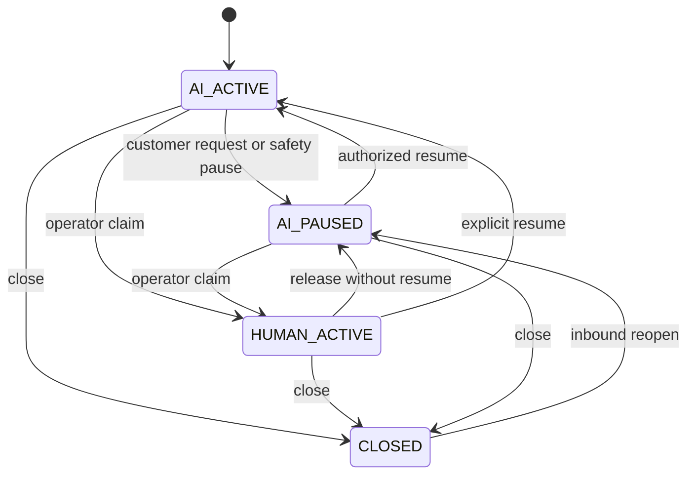

# Conversation ownership state machine

New conversations start AI_ACTIVE only when tenant/channel automation is enabled; otherwise initialize AI_PAUSED. Closed threads receiving new inbound content reopen paused for MVP so a prior safety or human decision is not silently undone.

Every transition increments ownership_epoch, checks expected version, writes actor/reason and audit event, and suppresses pending AI intents from older epochs. HUMAN_ACTIVE requires an active member owner; a unique row state prevents two simultaneous claims. Admin reassignment increments epoch. Member removal pauses owned conversations. Timeout/offline status never automatically resumes AI.

Handoff requests pause first, then notify operators through durable events. Notifications failing cannot restore AI control. Inbound content persists in all modes; model work and proactive follow-ups are suppressed unless explicitly eligible.

Send race: dispatcher atomically checks mode/epoch and marks DISPATCHING before provider I/O. Takeover suppresses PENDING intents and prevents new AI dispatch claims. An already DISPATCHING request may reach the provider after takeover; it cannot reliably be recalled. The inbox must display that in-flight exception. On API uncertainty, classify UNKNOWN and reconcile. Never promise zero post-click arrivals from already submitted sends.

Resume creates a fresh run from latest state and unread inputs; never reuse a stale generated draft. Test takeover during model generation, mutation validation, finalization and dispatch. [Conversation API](../07-api/conversation-api.md).

On resume the operator explicitly selects a handled-through ingress watermark, defaulting to the latest input visible in their timeline. Under the conversation row lock, mark that range handled by human and advance the processing cursor with an audited disposition; newer unseen inputs remain pending. Human-handled messages remain in context but are not each replayed as new AI requests. If no pending input remains, resume only changes mode; the next customer message triggers a run. This avoids duplicate responses to messages already answered by the operator.

handoffToHuman is a terminal control transaction: it checks the current fence/epoch, pauses and increments epoch, records the tool operation and terminal run disposition, marks the triggering input handled as escalated, and writes notification intent together. A fixed handoff acknowledgement may be created in that same transaction under a narrowly authorized CONTROL origin with the new epoch. It cannot contain arbitrary model text and still obeys channel eligibility and subsequent ownership changes. Do not attempt ordinary run finalization using the now-stale epoch.
