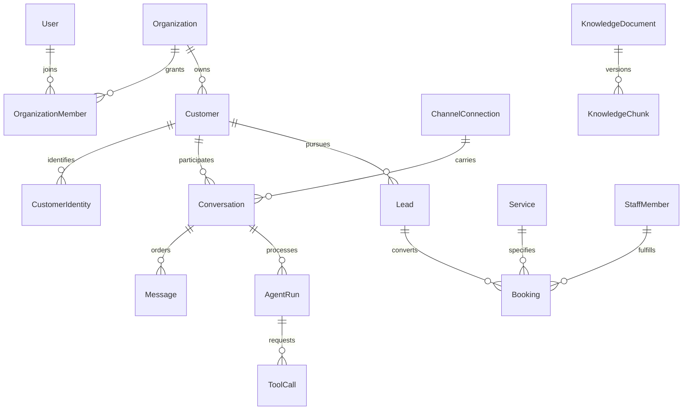

# Domain model

Every domain relationship above except global user identity is scoped by organization. Diagram omits infrastructure records and optional relationships for readability; [entity catalog](entities.md) defines them. A booking may be entered manually without a lead, but attribution must then be explicitly unassigned.

Conversation ownership, lead stage, booking status and message delivery are separate state machines. Do not overload a single status field to represent them. A customer can have multiple historical opportunities and bookings without duplicating their contact record.
