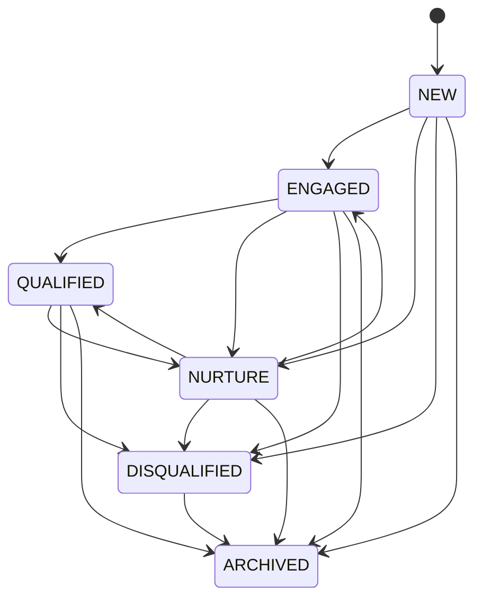

# Lead state machine (P06)

P06 does **not** include BOOKED/WON (P07+).

OPEN = NEW | ENGAGED | QUALIFIED | NURTURE.

Reason vocabularies:

- DISQUALIFIED: NOT_INTERESTED, OUT_OF_SCOPE, INVALID_CONTACT, DUPLICATE_REQUEST, OTHER
- ARCHIVED: MANUAL_ARCHIVE, MERGED_AFTER_CUSTOMER_MERGE, MERGED_DUPLICATE_OPEN_LEAD

AI may progress among non-terminal statuses only. ARCHIVE / DISQUALIFY are human/API only.
