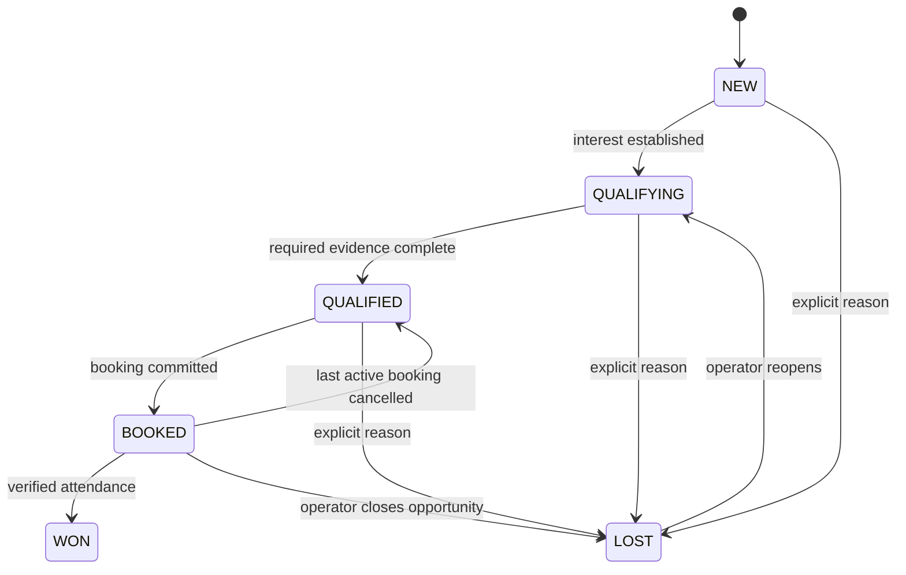

# Lead state machine

Qualification uses a versioned tenant policy (initially service interest, contact channel and scheduling intent). Persist evidence source per fact. Do not infer medical conditions, income or sensitive traits. A partial contact is allowed at NEW; required booking fields are checked later.

One open lead per customer and service interest is the default duplicate rule, with an explicit unknown-interest key. Resolving an unknown interest must check for an existing open opportunity before changing the key. Operator merge records provenance; never silently discard histories.

Only booking commands create BOOKED transitions. WON requires attendance evidence; it does not assert payment. Cancelling one of multiple active bookings does not downgrade the lead. LOST requires reason and actor; model can propose a reason but cannot reopen terminal leads automatically. Updates use expected version; stage history is append-only. See [lead tools](../04-agent/tool-contracts.md).
