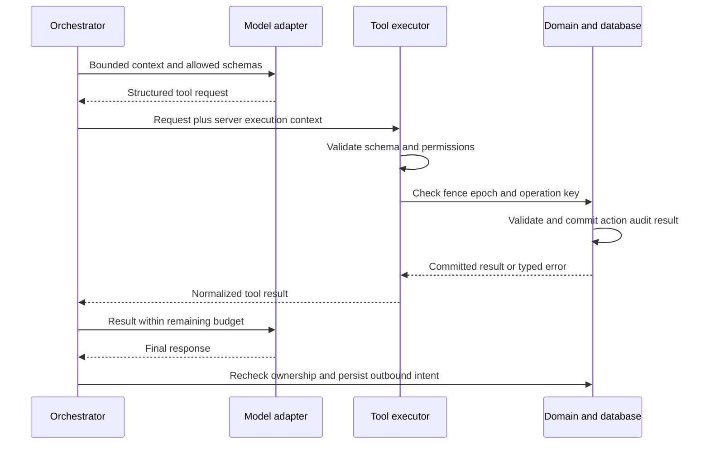

# Tool execution loop

Read calls may be parallelized only when independent and within provider/tool concurrency limits. Mutations execute serially, never using speculative model arguments as state. If one call fails, return its typed error; do not reinterpret failure as success or silently skip a required action.

Exceeding loop limits terminates the run and escalates. Repeating identical failing tool input consumes budget and cannot trigger unbounded repair. A handoff call ends ordinary reply generation. Malformed tool names/arguments never reach handlers. Trace attempts separately from committed operations so retry volume remains observable.
