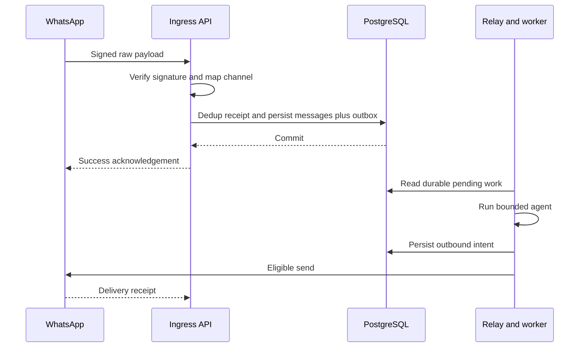

# Webhook ingestion lifecycle

GET subscription challenge compares configured verification token and returns the challenge only on a match. POST verification checks a constant-time HMAC comparison over unmodified raw request bytes using the app secret. These credentials have different roles; a challenge token is not POST authentication. Validate actual current provider header/payload conventions in the sandbox. [Meta-hosted signature reference](https://whatsapp.github.io/WhatsApp-Nodejs-SDK/api-reference/webhooks/start/).

Bound request size (proposed 1 MB), timestamp parsing and batch length. Normalize each message/status independently, resolve verified phone/account mapping, and commit durable receipt/message/outbox before 2xx. Invalid signatures reject; database failure returns retryable server error; signed unsupported events commit quarantine before acknowledgement. Do not wait for the LLM in this endpoint.

Batch retries cannot duplicate already committed items. Unknown channel events do not get a guessed tenant; retain only restricted minimal metadata. Body hashes alone are insufficient message deduplication. Late status callbacks do not regress state. See [webhook API](../07-api/webhook-api.md).
