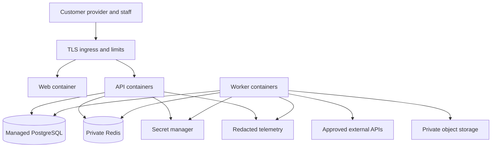

# Deployment architecture

Network-restrict database/Redis to app identities; expose only TLS web/API ingress. Keep model calls and document parsing in workers. Scale workers against queue age and provider budgets rather than starting unlimited concurrent model requests. Database fencing permits multiple workers without relying on process-local locks.

One selected region is sufficient initially; data residency and provider processing locations are P00 decisions. Multi-region active-active is deferred. Deploy health checks, migrations, secret mounts, resource limits and egress allowlists before real customer traffic.

Rollout: stage → test tenant → one pilot tenant → remaining approved tenants. Rollback first disables automated effects, then restores compatible application version or forward-fixes. Keep human access when safe. Restore procedure separately prevents historical outbox from resending messages. [Recovery](backup-and-recovery.md).
