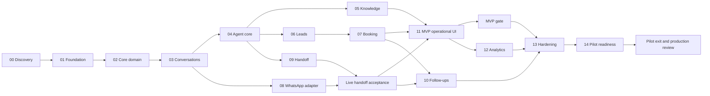

# Master implementation plan

Status: reconciled 2026-09-24. P00–P13 engineering phases are **CLOSED**; P14 is **NOT_STARTED** and **not authorized**. Engineering closure remains separate from required external/live acceptance.

## Complete phase list and relative complexity

- [Phase 00 — Discovery and architecture validation](phase-00-discovery.md): M; **CLOSED — READY_FOR_P01** ([closure](phase-00-closure.md)); pilot items deferred.
- [Phase 01 — Project foundation and tenant security](phase-01-foundation.md): L; **CLOSED — READY_FOR_P02** (see [closure](phase-01-closure.md)).
- [Phase 02 — Core domain model](phase-02-core-domain.md): M; **CLOSED — READY_FOR_P03** (see [closure](phase-02-closure.md)).
- [Phase 03 — Durable customers and conversations](phase-03-conversations.md): L; **CLOSED** ([closure](phase-03-closure.md)).
- [Phase 04 — Bounded agent core and safe tools](phase-04-agent-core.md): XL; **CLOSED** ([closure](phase-04-closure.md)).
- [Phase 05 — Approved knowledge and RAG](phase-05-knowledge-rag.md): L; **CLOSED** ([closure](phase-05-closure.md)).
- [Phase 06 — Lead management and qualification](phase-06-leads-crm.md): M; **CLOSED** ([closure](phase-06-closure.md)).
- [Phase 07 — Services, availability and safe booking](phase-07-booking-tools.md): XL; **CLOSED** (see [phase-07-closure](phase-07-closure.md)).
- [Phase 08 — WhatsApp transport integration](phase-08-whatsapp.md): L; **ENGINEERING CLOSED** ([closure](phase-08-closure.md)); live provider acceptance **NOT_RUN**.
- [Phase 09 — Human takeover and safe resume](phase-09-human-handoff.md): L; **CLOSED** ([closure](phase-09-closure.md)).
- [Phase 10 — Consent-aware follow-up engine](phase-10-followups.md): M; **ENGINEERING CLOSED** ([closure](phase-10-closure.md)); live template acceptance **NOT_RUN**.
- [Phase 11 — Operational UI and dashboard](phase-11-dashboard.md): L; CLOSED ([closure](phase-11-closure.md)).
- [Phase 12 — Usage, funnel and business outcomes](phase-12-analytics.md): M; **CLOSED — TECHNICALLY_READY_FOR_P13** ([validation](phase-12-validation-report.md)).
- [Phase 13 — Security, performance and resilience validation](phase-13-hardening.md): XL; **CLOSED — TECHNICALLY_READY_FOR_P14** ([closure](phase-13-closure.md), [resilience/load](phase-13-resilience-load-report.md)); **P14_AUTHORIZED: NO**.
- [Phase 14 — Pilot readiness and controlled launch](phase-14-pilot-readiness.md): M; NOT STARTED; **not authorized**. Pre-P14 zero-cost discovery only: [pre-p14-zero-cost-discovery.md](pre-p14-zero-cost-discovery.md) (**PATH B**; **P14_AUTHORIZED: NO**).

S means a narrow well-understood change; M spans a few cohesive commands/UI flows; L spans stateful modules and integration; XL carries substantial concurrency, safety or resilience uncertainty. Sizes are relative, not additive calendar estimates. No phase is forced into S just to populate every category.

## Dependency graph

P08 development requires P03 and P00 provider access; full integrated tests also consume P04–P07 outputs. P09 can be developed with the fake channel after P04; it cannot close real-channel acceptance without P08. The graph separates these to avoid a circular dependency. Follow-up UI completes after P10 and is not a prerequisite for the first MVP cut of P11.

## Implementation order

### Proposed sequence

Default single-team order: P00 → P01 → P02 → P03 → P04 → P05 → P06 → P07 → P08 → P09 → P11 MVP slice → MVP gate → P10 → P11 reminder controls → P12 → P13 → P14. Phase numbers preserve the requested organization; dependency-driven scheduling moves the necessary UI before the optional MVP reminder engine.

With independent contributors, P05/P06/P08 can progress after their own prerequisites; P09 follows P04 and joins P08 for live acceptance. This is a scheduling option, not authorization to start unapproved implementation. Start tiny UI slices in P03/P05/P06/P07/P09 so backend behavior is reviewable before P11 integration.

### Actual completed sequence

P00 → P01 → P02 → P03 → P04 → P05 → P06 → P07 → P08 → P09 → P10 → P11 → P12.

This records execution history and does not replace the proposed dependency-driven sequence above.

## Critical path

Provisional integrity path: P00 → P01 → P02 → P03 → P04 → P06 → P07 → P11 → P12 → P13 → P14. Knowledge and live handoff/WhatsApp branches must join before MVP; P10 also joins before P13. Without effort/capacity estimates no mathematical longest duration is asserted. WhatsApp onboarding or external calendar requirements may become the actual calendar-time bottleneck; resolve in discovery.

## Milestones

- M0 Architecture approved: P00 evidence, decision owners and explicit P01 authorization recorded.
- M1 Safe foundation: P01–P03 demonstrate tenant isolation, durable input ordering and crash recovery using a fake channel.
- M2 Controlled assistant: P04–P07 demonstrate grounded answers, bounded tools, lead evidence and race-safe confirmed booking with deterministic fixtures.
- M3 MVP engineering foundation: durable conversations, bounded agent core, RAG, leads, bookings, WhatsApp transport, human takeover, follow-ups, dashboard and analytics are closed with their engineering tests. External Meta provider/template acceptance is tracked separately and is not implied by engineering closure.
- M4 Pilot ready: P13 hardening and P14 readiness tasks pass; named owners approve limited external pilot activation; the pending live Meta sandbox/provider and template-send acceptances are completed.
- M5 Pilot exit: observed results and incidents reviewed after the agreed pilot window; separate production go/no-go record. P14 closure includes this observation/recommendation task, not merely enabling a tenant.

## MVP boundary

The MVP engineering foundation includes durable conversations, bounded agent core, approved RAG, leads, bookings, WhatsApp transport, human takeover/resume, follow-ups, dashboard and `analytics_overview:v1`. Required ownership, security, query-performance and regression tests pass. Live Meta provider/template acceptance remains an external readiness dependency, not an engineering-closure failure.

No Instagram, public web chat, payment gateway, voice, giant CRM, campaigns, mobile application, fine-tuning, microservices or Kubernetes. Cost is unavailable without a versioned tariff ledger; knowledge effectiveness is unavailable without causal experiment design; attendance and revenue are unavailable without authoritative facts. These are explicit deferred truths, not unfinished defects.

## Pilot boundary

Proposed maximum five organizations with one location each, consent-aware reminders, minimum funnel/cost/outcome evidence, approved model/language dataset, measured load/restore/security gates, trained operators, support coverage and kill switch. Duration and outcome targets come from P00; do not invent a conversion uplift or fixed launch date. Pilot means controlled real usage with active operational review.

Before pilot activation, complete the P13 hardening gate, P14 readiness gate, live Meta sandbox/provider acceptance for P08, and live approved-template send verification for P10. These are external/live acceptance dependencies and do not reopen the P08 or P10 engineering closures.

## Current regression baseline

- P01–P12 integration: **21 / 21 PASS**, **0 skipped**.
- Hosted Auth: **PASS**.
- Phase 03 global outbox claim: **PASS**.
- Query performance: **PASS**.
- Build, lint and typecheck: **PASS**.
- Security and privacy: **PASS**.

## Current readiness

- `analytics_overview:v1`: **CLOSED**; no migration required.
- P08 live provider acceptance: **NOT_RUN** — human Meta sandbox/provider action remains pending.
- P10 live template acceptance: **NOT_RUN** — real Meta template approval and send verification remain external.
- `TECHNICALLY_READY_FOR_P13`: **YES**.
- `P13_AUTHORIZED`: **NO**.

## Production boundary

General availability requires pilot exit approval, resolved critical findings, approved privacy/processing arrangements, demonstrated SLO/recovery objectives, incident ownership, stable provider lifecycle, deletion/offboarding, spending/capacity controls and documented support. Production does not automatically require future channels or new infrastructure. Additional scale is justified by measured load and demand.

## Deferred scope

See [future roadmap](future-roadmap.md): external calendar sync, multi-location/resource/recurrence, payments, external CRM, Instagram/Web Chat, voice and advanced automation. If an item is essential to a pilot business, revise the MVP/critical path through ADR rather than silently inserting it.

## Major risks and closure discipline

Highest risks: tenant leakage (R01), duplicate/conflicting actions (R02), unsupported model claims (R03), provider onboarding/policy (R04), wrong calendar authority (R05), takeover races (R06), sensitive data (R08), and restore/send uncertainty (R10). [Risk register](../13-risks/risk-register.md) assigns proposed owners and triggers.

Every phase requires implementation, tests, acceptance evidence, updated docs and reviewer approval. All checkboxes remain unchecked until verified. Use [closure template](phase-closure-template.md); unresolved required work prevents CLOSED status regardless of file count.
