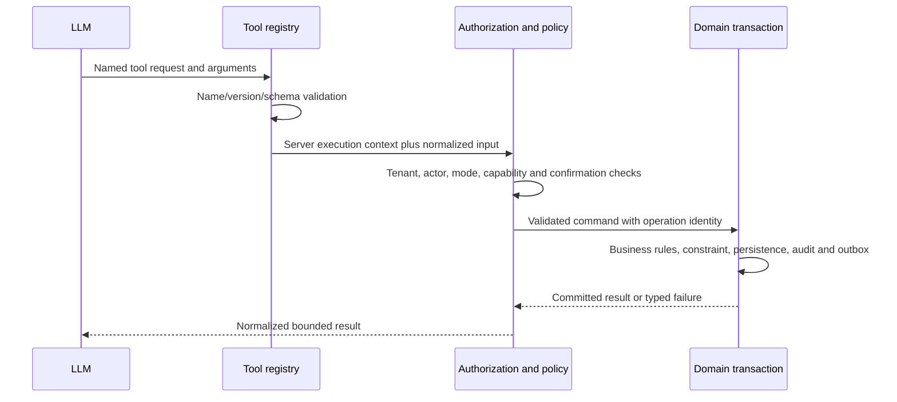

# Phase 00 AI trust boundary

Status: ACCEPTED INVARIANT; implementation remains future work under ADR-005.

The LLM decides conversational intent and proposes a response or named tool request. The backend resolves tenant/customer/actor authority, validates input, enforces business rules, executes and persists state, audits the action, and returns a normalized result. Model output is untrusted input throughout.

The model cannot write arbitrary records; select tenant/actor/customer authority; confirm an unverified price; invent availability; treat a slot offer as reserved; manufacture customer confirmation; claim a booking/cancel/reschedule before commit; change tenant configuration/roles/credentials; bypass mode or authorization; execute SQL, arbitrary HTTP, filesystem or code; publish knowledge; record attendance/revenue; or expand its available tools.

Every tool definition has a semantic version, strict bounded input/output schema with unknown fields rejected, capability, read/mutate classification, timeout/retry class, authorization policy, confirmation rule, handler, normalized errors, audit/redaction policy, and idempotency semantics. Server context injects organization, actor, conversation/customer binding, epoch/fence, operation key, budgets, and trace IDs. The model never supplies these as authority.

Conceptual loop limits remain proposed: four tool rounds, eight total tool calls, five model calls, 45-second run deadline, 15 seconds per model call, and five seconds per local tool. Mutations execute serially. One schema repair/fallback consumes the same total budget. Repeated identical failure, malformed output, limit exhaustion, provider outage, insufficient evidence, or denied/uncertain action ends safely with clarification/handoff/pause. A fallback reuses committed operation results and never replays an ambiguous mutation.

Final output gating rechecks current conversation mode, ownership epoch, lease fence, input watermark, and evidence for all action claims before recording outbound intent. Critical booking text is rendered from the committed backend result. Hidden model reasoning is neither requested nor an authorization/audit source; persist a redacted context manifest, tool inputs/results, versions, usage, and action references sufficient to explain system behavior.

Acceptance in P04/P07 requires deterministic denial/replay tests plus evaluation fixtures. ADR-005 acceptance establishes the design constraint only; it does not mark agent implementation complete.

