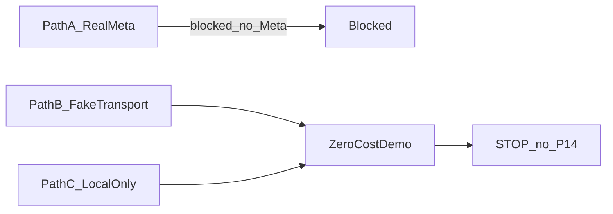

# ZERO-COST LIVE DISCOVERY REPORT

Date: 2026-09-24. Read-only inspection of repository, compose, docs, and env **key presence** (secret values never recorded here). No Meta/billing/tunnel changes. **P14 not started. P14_AUTHORIZED: NO.**

This report does **not** authorize Phase 14, real Meta sends, paid usage, or plan upgrades.

## Evidence basis

- Env presence: `.env.local` has Supabase + DB URLs **PRESENT**; all `META_*` / `AI_MODEL_*` **ABSENT**. `.env` has `APP_URL` / `API_URL` / `REDIS_URL` local. `.env.example` documents Meta keys as commented stubs.
- Meta: [phase-00-whatsapp-discovery.md](phase-00-whatsapp-discovery.md) **BLOCKED — HUMAN ACTION**; [phase-08-closure.md](phase-08-closure.md) `LIVE_PROVIDER_ACCEPTANCE: NOT_RUN`; live template acceptance **NOT_RUN**.
- Fake/dev path: `FakeMessagingChannel`; `POST /v1/organizations/:id/dev/messaging/inbound` (non-production); worker allows Fake when `NODE_ENV !== 'production'`.
- Infra observed: Docker `ai-sales-agent-redis` → `127.0.0.1:6379`, `ai-sales-agent-postgres` → `5433`; **TEI container not running** at discovery time.
- Seed: `prisma/seed.ts` orgs/members only — no services/staff/locations/knowledge.

---

## Report

**META APP:**  
ABSENT locally (no Meta secrets in `.env` / `.env.local`). Docs: Meta onboarding **BLOCKED — HUMAN ACTION**. Engineering webhook/adapter code PRESENT.

**META TEST NUMBER:**  
NOT_AVAILABLE

**META TEST RECIPIENT:**  
ABSENT / UNKNOWN (no env or recorded permitted recipient)

**META WEBHOOK:**  
Code PRESENT (`GET/POST /v1/webhooks/whatsapp/meta`). Verify token / app secret / access token: **ABSENT** in local env. Public HTTPS callback URL: **ABSENT**. Tunnel tooling: **ABSENT**.

**META FREE LIVE PATH:**  
NO

**LIVE TEMPLATE ZERO-COST PATH:**  
NO

**AI PROVIDER:**  
ABSENT live key (`AI_MODEL_API_KEY`). Default non-prod path: Fake model via worker (`NODE_ENV !== 'production'`). Optional OpenAI-compatible if key set later. Free credit balance: **UNKNOWN** (no key configured to check).

**AI ZERO-NEW-SPEND PATH:**  
YES (Fake / explicit non-production test mode; do not set production + real key for this path)

**SUPABASE:**  
EXISTING_PLAN (hosted project config PRESENT in `.env.local`). Billing tier / free allowance: **UNKNOWN_COST** (not proven from repo; no console inspection performed)

**REDIS:**  
FREE (local Docker `redis:7.4-alpine`, healthy; `REDIS_URL=redis://127.0.0.1:6379`)

**PUBLIC HTTPS/TUNNEL:**  
ABSENT (no ngrok/cloudflare/smee scripts or docs). Webhook-to-local Meta path not supported without human-added free tunnel + Meta console change (out of discovery scope).

**LOCAL API:**  
READY (`npm run dev:api`; `APP_URL`/`API_URL` local)

**LOCAL WORKER:**  
READY (`npm run dev:worker`)

**LOCAL WEB:**  
READY (`npm run dev:web` → Next `:3000`)

**EMBEDDING:**  
NOT_READY at discovery (TEI not running). Local free path EXISTS (`docker compose` `tei` + default `local_qwen`). Remote embedding key: ABSENT.

**SYNTHETIC TENANT:**  
READY for org/members (`npm run db:seed` + `ALLOW_DB_SEED=true`; `auth:provision-test-user`). Catalog/staff/location/knowledge fixtures: **NOT in seed** → NOT_READY without additional free local setup via API/UI/tests.

### LIVE JOURNEY READINESS

| Step | Status |
|------|--------|
| Inbound | READY_FREE (dev simulated inbound; Meta inbound BLOCKED_CONFIGURATION) |
| AI reply | READY_FREE (Fake model non-prod) |
| Lead | READY_FREE (API/tools exist); full AI-lead demo BLOCKED_CONFIGURATION until agent allowlist set (free) |
| Availability | BLOCKED_CONFIGURATION (no seed staff/services/availability; code PRESENT) |
| Booking | BLOCKED_CONFIGURATION (same + `BOOKING_SLOT_TOKEN_SECRET` ABSENT unless `AI_ALLOW_FAKE=true` or local secret — free) |
| Conflict test | BLOCKED_CONFIGURATION (depends on booking setup) |
| Human takeover | READY_FREE (API/UI; needs auth + conversation) |
| Operator reply | READY_FREE |
| Resume AI | READY_FREE |
| Follow-up | READY_FREE for durable schedule/core; Meta template send BLOCKED_CONFIGURATION / LIVE_TEMPLATE NOT_RUN |
| Dashboard | READY_FREE |
| Analytics | READY_FREE |
| Emergency AI kill | READY_FREE (org API + env global) |
| Duplicate inbound | READY_FREE (webhook receipt / providerMessageId dedupe; provable via fake/dev path) |

**STRONGEST ZERO-COST PATH:**  
B

(PATH A blocked: no Meta app/number/secrets/webhook URL. PATH C also viable for pure local Docker Postgres+Redis+Fake, but `.env.local` may prefer hosted Supabase DB — still not “real Meta.” PATH D not selected: B is exercisable.)

**ESTIMATED NEW SPEND REQUIRED:**  
0

**UNKNOWN-COST ITEMS:**
- Supabase plan/tier and any egress beyond existing project
- Any future LLM API free-credit balance (key ABSENT; unused)
- Meta pricing if PATH A pursued later (not available today)

**PAID-REQUIRED ITEMS:**
- None required for PATH B
- PATH A later: Meta Business / phone / possible paid WhatsApp costs — **UNKNOWN** until human Meta account; treat as potential PAID_REQUIRED until proven free sandbox

**BLOCKERS:**
1. Meta credentials, test number, permitted recipient, public HTTPS webhook — block PATH A and live template
2. No tunnel tooling in repo — blocks Meta→local webhook without external free tunnel + console change
3. TEI not running — blocks live local embedding until compose start (free)
4. Seed lacks services/staff/locations/knowledge — blocks availability/booking/conflict without free local setup
5. `BOOKING_SLOT_TOKEN_SECRET` ABSENT — booking tokens need free local secret or `AI_ALLOW_FAKE`
6. Agent default allowlist may omit lead/booking/follow-up tools — free config change if AI-driven demo required

**RECOMMENDED NEXT ACTION:**  
Run **PATH B** demo only (not P14): start API + worker + web + Redis; optional TEI; set free local Fake flags/secrets; use `dev/messaging/inbound` + UI for takeover/kill/dashboard; seed or API-create catalog for booking. Do **not** enable Meta, billing, or paid LLM until human explicitly authorizes and cost is proven free. Keep **P14_AUTHORIZED: NO**.

**P14_AUTHORIZED:**  
NO

---

## Cost classification

| Dependency | Class |
|------------|--------|
| Meta WhatsApp | UNKNOWN_COST (unavailable); PATH A blocked |
| LLM/model | FREE_CONFIRMED via Fake non-prod; paid API UNKNOWN_COST if key added |
| Supabase | EXISTING_PLAN_NO_NEW_SPEND for continued use; tier UNKNOWN_COST |
| Redis | FREE_CONFIRMED (local Docker) |
| Tunnel/public endpoint | ABSENT; free tunnel would be human-added UNKNOWN until chosen |
| Storage (Supabase) | EXISTING_PLAN_NO_NEW_SPEND / UNKNOWN_COST tier |
| Embedding | FREE_CONFIRMED when local TEI started; remote key ABSENT |
| Local Postgres Docker | FREE_CONFIRMED (available; `.env` points local; `.env.local` may override DB to hosted) |

## STOP

Do not execute Phase 14. Do not send WhatsApp. Do not enable billing. Do not register numbers or upgrade plans.
