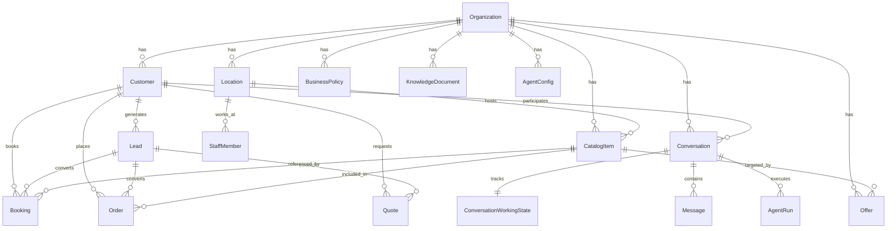

# Multi-Business Platform — Domain Model

> Conceptual data model for the multi-business evolution.
> Each concept is classified by its current status and migration path.

---

## Classification Legend

| Status | Meaning |
|--------|---------|
| **EXISTING** | Table exists in current schema — no changes needed |
| **EXTEND_EXISTING** | Table exists but needs new columns or modifications |
| **NEW_LATER** | New table — created during a future phase |
| **DO_NOT_CREATE_YET** | Concept identified but deferred beyond current planning horizon |

---

## Domain Concepts

### Organization (EXTEND_EXISTING)

**Current:** `organizations` table with `id`, `name`, `aiEmergencyDisabled*`, timestamps.

**Proposed extension:**
| Column | Type | Default | Phase |
|--------|------|---------|-------|
| `business_type` | String? | `null` | MB-01 |
| `business_description` | String? | `null` | MB-01 |
| `logo_url` | String? | `null` | MB-01 |
| `default_timezone` | String? | `null` | MB-01 |
| `default_locale` | String? | `null` | MB-01 |
| `capabilities_json` | JSONB | `{}` | MB-01 |
| `conversation_style_json` | JSONB | `{}` | MB-07 |
| `onboarding_progress_json` | JSONB? | `null` | MB-02 |

**Source-of-truth ownership:** Organization settings API (ADMIN/OWNER only).

**Migration note:** All new columns have safe defaults. Existing dental orgs unaffected.

---

### OrganizationCapabilities (Embedded in Organization — MB-01)

**Storage:** `capabilities_json` JSONB column on `organizations`.

**Why JSONB, not a separate table:** Capabilities are read-heavy, write-rare, and always fetched alongside the organization. JSONB avoids a JOIN and simplifies the API.

**Proposed structure:**
```json
{
  "supportsLeads": true,
  "leadRequiredBeforeBooking": true,
  "autoCreateLeadOnIntent": true,
  "supportsBooking": true,
  "supportsOffers": false,
  "supportsQuotes": false,
  "supportsOrders": false,
  "supportsInventory": false,
  "supportsStaff": true,
  "supportsLocations": true,
  "supportsProducts": false,
  "supportsServices": true,
  "supportsListings": false
}
```

**Default for existing dental orgs:**
```json
{
  "supportsLeads": true,
  "leadRequiredBeforeBooking": true,
  "autoCreateLeadOnIntent": true,
  "supportsBooking": true,
  "supportsStaff": true,
  "supportsLocations": true,
  "supportsServices": true
}
```

---

### ConversationProfile (IMPLEMENTED — MB-07)

**Storage:** Dedicated `organization_conversation_profiles` table with 1-to-1 relationship to `organizations`.

**Structure:**
| Column | Type | Default | Notes |
|--------|------|---------|-------|
| `organization_id` | UUID (PK) | — | References `organizations(id)` ON DELETE CASCADE |
| `assistant_name` | Text? | `null` | Presentation metadata name |
| `primary_language` | Text | `'ar'` | Preferred response language |
| `dialect` | Text | `'IRAQI'` | `IRAQI` / `MSA` / `AUTO` |
| `tone` | Text | `'PROFESSIONAL'` | `WARM` / `PROFESSIONAL` / `FRIENDLY` / `DIRECT` / `NEUTRAL` |
| `formality` | Text | `'BALANCED'` | `CASUAL` / `BALANCED` / `FORMAL` |
| `response_length` | Text | `'BALANCED'` | `SHORT` / `BALANCED` / `DETAILED` |
| `sales_style` | Text | `'BALANCED'` | `LOW_PRESSURE` / `BALANCED` / `PROACTIVE` |
| `emoji_usage` | Text | `'MINIMAL'` | `NEVER` / `MINIMAL` / `NORMAL` |
| `customer_name_usage` | Text | `'WHEN_KNOWN'` | `NEVER` / `WHEN_KNOWN` / `OCCASIONAL` |
| `questions_per_turn` | Integer | `1` | Max questions per response (1-3) |
| `greeting_style` | Text | `'BRIEF'` | `BRIEF` / `WARM` / `FORMAL` / `CUSTOM` |
| `handoff_style` | Text | `'PROFESSIONAL'` | `PROFESSIONAL` / `WARM` / `DIRECT` |
| `custom_instructions` | Text? | `null` | Scoped style guidance (max 500 chars) |
| `created_at` / `updated_at` | Timestamptz | `now()` | Timestamp tracking |

---

### CatalogItem / Service Specialization (IMPLEMENTED — MB-04)

**Current:** `catalog_items` table (generic item truth) + `services` table (specialized booking truth linked via `services.catalog_item_id`).

**Structure:**
| Column | Type | Default | Notes |
|--------|------|---------|-------|
| `catalog_items.id` | UUID | `gen_random_uuid()` | Authoritative catalog item ID |
| `catalog_items.kind` | String | `"SERVICE"` | `SERVICE` / `PRODUCT` / `LISTING` / `PACKAGE` / `OTHER` |
| `catalog_items.name` | String | — | Generic item title |
| `catalog_items.description`| String?| `null` | Item description |
| `catalog_items.sku` | String? | `null` | SKU / Reference |
| `catalog_items.amount_minor`| BigInt?| `null` | Price |
| `catalog_items.currency` | Char(3)? | `null` | Currency |
| `catalog_items.status` | String | `"ACTIVE"` | `ACTIVE` / `INACTIVE` / `ARCHIVED` |
| `catalog_items.metadata_json`| JSONB?| `null` | Extensible metadata |
| `services.catalog_item_id`| UUID | FK → `catalog_items` | Links booking specialization |

**Backward compatibility:**
- All existing `services.id` preserved; existing `bookings.service_id` and `leads.primary_service_id` unbroken.
- Backfill automatically generated `CatalogItem` records for all existing services.
- `searchServices` tool joins/operates seamlessly.
- RLS enabled & forced on `catalog_items`.

**Source-of-truth ownership:** Catalog API (org members). CatalogItem owns generic fields; Service owns booking-specific fields.

---

### Offer / OfferCatalogItem (EXISTING — IMPLEMENTED in MB-05)

**Implemented schema:**
```sql
Offer
  id: UUID PRIMARY KEY
  organization_id: UUID (FK → organizations)
  name: String (1..160 chars)
  description: String? (<=2000 chars)
  status: String ("DRAFT" | "ACTIVE" | "PAUSED" | "ARCHIVED")
  offer_type: String ("PERCENTAGE_DISCOUNT" | "FIXED_DISCOUNT" | "FIXED_PRICE" | "INFORMATIONAL")
  discount_percentage: Int? (1..100)
  discount_amount_minor: BigInt? (>= 0)
  currency: String? (3 uppercase chars)
  starts_at: Timestamptz?
  ends_at: Timestamptz?
  priority: Int (default: 0)
  stackable: Boolean (default: false)
  eligibility: String ("ANY_CUSTOMER" | "NEW_CUSTOMER" | "EXISTING_CUSTOMER")
  metadata_json: JSONB?
  version: Int (default: 1)
  archived_at: Timestamptz?
  created_at / updated_at: Timestamptz

OfferCatalogItem
  organization_id: UUID
  offer_id: UUID (FK → offers)
  catalog_item_id: UUID (FK → catalog_items)
  PRIMARY KEY (organization_id, offer_id, catalog_item_id)
```

**Source-of-truth ownership:** Offers API (org ADMIN). AI reads via `getActiveOffers` tool, never hallucinates or mutates offers. Deterministic calculation via `calculateDiscountedPrice()`. RLS enabled and forced on `offers` and `offer_catalog_items`.

---

### BusinessPolicy (EXISTING — IMPLEMENTED in MB-06)

**Implemented schema:**
```
BusinessPolicy
  id: UUID
  organizationId: UUID (FK → organizations)
  policyType: String  -- "BOOKING" | "CANCELLATION" | "REFUND" | "DELIVERY" | ...
  status: DRAFT | ACTIVE | ARCHIVED
  title: String
  summary: String  -- human-readable explanation
  rulesJson: JSONB  -- validated per policy type
  enforcementMode: ENFORCEABLE | INFORMATIONAL_ONLY
  effectiveFrom: DateTime? (UTC instant)
  effectiveUntil: DateTime? (UTC instant)
  version: Int
  createdAt: DateTime
  updatedAt: DateTime
```

**Key distinction:**
- `rulesJson` = machine-readable, backend-enforced (e.g., `{"minAdvanceHours": 24}`)
- `summary` = customer-facing explanation (e.g., "يجب الإلغاء قبل ساعتين")
- Knowledge base = supplementary context (FAQs, detailed explanations)

Only `CANCELLATION` and `RESCHEDULING` are enforceable in MB-06. Resolution uses highest version, latest effective start, then latest creation time. Service lead/advance settings and buffers remain owned by the booking configuration.

---

### Customer (EXISTING)

**Current status:** Already generic — `id`, `organizationId`, `displayName`, `preferredLocale`, `version`.

**No changes needed.** Customer represents identity/contact regardless of business type.

**Important distinction:**
- **Customer** = identity/contact (who is this person?)
- **Lead** = sales opportunity/commercial interest (what do they want?)
- A Customer **MUST** be allowed to exist without a Lead.
- A Lead always references a Customer.

---

### Lead (EXISTING)

**Current status:** Already generic — `id`, `organizationId`, `customerId`, `status`, `primaryServiceId`, `locationId`, assignment fields, source tracking.

**Minor future extension (MB-04):**
- `primaryServiceId` → should also work with non-SERVICE catalog items
- Consider renaming to `primaryCatalogItemId` (or keeping backward-compatible alias)

**Source-of-truth ownership:** Lead tools (AI + org members).

---

### Booking (EXISTING)

**Current status:** Full booking model — customer, service, location, staff, time slots, buffers, status, cancellation, activity tracking.

**No changes needed.** Booking remains a capability-gated feature that operates on SERVICE-type catalog items.

**Source-of-truth ownership:** Booking tools (AI + backend validation).

---

### Order (NEW_LATER — MB-12)

**Proposed schema (conceptual):**
```
Order
  id: UUID
  organizationId: UUID
  customerId: UUID
  leadId: UUID?
  status: String  -- "DRAFT" | "CONFIRMED" | "PROCESSING" | "FULFILLED" | "CANCELLED"
  itemsJson: JSONB  -- [{catalogItemId, quantity, unitPrice, total}]
  totalMinor: BigInt
  currency: String
  sourceConversationId: UUID?
  createdByType: String
  createdByAgentRunId: UUID?
  version: Int
  createdAt: DateTime
  updatedAt: DateTime
```

**Source-of-truth ownership:** Order tools (AI + backend validation).

---

### Quote (NEW_LATER — MB-12)

**Proposed schema (conceptual):**
```
Quote
  id: UUID
  organizationId: UUID
  customerId: UUID
  leadId: UUID?
  status: String  -- "DRAFT" | "SENT" | "ACCEPTED" | "REJECTED" | "EXPIRED"
  itemsJson: JSONB
  totalMinor: BigInt
  currency: String
  validUntil: DateTime?
  sourceConversationId: UUID?
  createdByType: String
  version: Int
  createdAt: DateTime
  updatedAt: DateTime
```

---

### KnowledgeDocument / KnowledgeChunk (EXTENDED — MB-08)

**Status:** Generic organization-owned unstructured and semi-structured knowledge with review and publish lifecycle.

**MB-08 Columns on `KnowledgeDocument`:**
| Column | Type | Default | Description |
|---|---|---|---|
| `source_type` | String | `'FILE'` | `TEXT`, `FAQ`, `FILE`, `URL`, `MANUAL_NOTE` |
| `visibility` | String | `'CUSTOMER_VISIBLE'` | `CUSTOMER_VISIBLE`, `INTERNAL_ONLY` |
| `metadata_json` | JSONB? | `null` | Structured Q&A, tags, source reference |

- **Chunking Profile**: `chunk_v1`
- **Embedding Model**: `qwen3_embed_06b_1024_v1` (1024-dim pgvector)
- **Precedence**: Structured backend truth (Catalog, Offers, Policies, Booking) strictly wins over knowledge text.

---

### Conversation / ConversationWorkingState (EXISTING)

**Current status:** Already generic. No changes needed.

---

### Location (EXISTING)

**Current status:** Already generic — name, timezone, address, active flag.

**No changes needed.**

---

### StaffMember (EXISTING)

**Current status:** Already generic — display name, location, active flag.

**No changes needed.** Becomes capability-gated (`supportsStaff`).

---

### AgentConfig (EXISTING)

**Current status:** Already generic — version, tool allowlist, model profile, prompt version.

**Minor future consideration:** Tool allowlist validation could cross-reference capabilities.

---

### MessageTemplate / FollowUp (EXISTING)

**Current status:** Already generic. No changes needed.

---

## Entity Relationship Summary



---

## Migration Classification Summary

| Concept | Status | Phase |
|---------|--------|-------|
| Organization | EXTEND_EXISTING | MB-01 |
| OrganizationCapabilities | EXTEND_EXISTING (JSONB) | MB-01 |
| ConversationProfile | EXTEND_EXISTING (JSONB) | MB-07 |
| Service/CatalogItem | EXTEND_EXISTING | MB-04 |
| Offer | NEW_LATER | MB-05 |
| BusinessPolicy | EXISTING | MB-06 |
| Order | NEW_LATER | MB-12 |
| Quote | NEW_LATER | MB-12 |
| Customer | EXISTING | — |
| Lead | EXISTING | — |
| Booking | EXISTING | — |
| KnowledgeDocument | EXISTING (minor extend) | MB-08 |
| Conversation | EXISTING | — |
| ConversationWorkingState | EXISTING | — |
| Location | EXISTING | — |
| StaffMember | EXISTING | — |
| AgentConfig | EXISTING | — |
| MessageTemplate | EXISTING | — |
| FollowUp | EXISTING | — |
