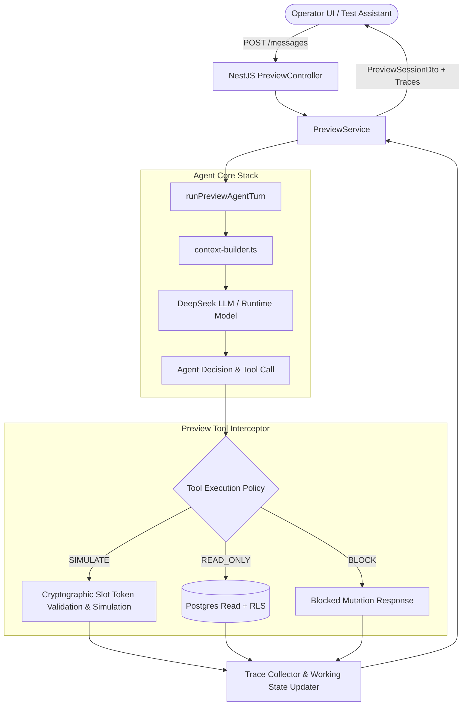

# MB-09 — PREVIEW / TEST ASSISTANT IMPLEMENTATION

## Status: CLOSED

## 1. Executive Summary

MB-09 introduces a first-class, safe **Preview / Test Assistant** environment that enables authorized business operators to test assistant reasoning, style, catalog truth, offers, policies, and knowledge retrieval before going live, with strict guarantees against unintended real-world side effects.

Key Accomplishments:
- **Explicit Execution Mode**: First-class `AgentExecutionMode = 'PREVIEW' | 'PRODUCTION'`.
- **Full Agent Stack Reuse**: Exercises the real context builder, DeepSeek runtime model, tool selector, structured truth precedence, and conversation personality.
- **Strict Tool Interception Policy**:
  - `READ_ONLY`: Queries real catalog, offers, business policies, and published customer-visible knowledge chunks under strict tenant RLS.
  - `SIMULATABLE_MUTATION`: `createBooking`, `ensureLead`, `cancelBooking`, `rescheduleBooking` validate real preconditions (such as cryptographic HMAC `slotToken` validation and service bookability) and return structured simulation results `{ simulated: true, wouldSucceed: true/false }` without inserting database rows.
  - `BLOCKED_EXTERNAL`: `sendMessage` and external integrations are unconditionally blocked.
  - `FAIL_CLOSED`: Any unclassified mutation tool defaults to `BLOCKED`.
- **Zero Production Side Effects**: Zero rows created in `bookings`, `leads`, `customers`, `follow_ups`, `messages`, `conversations`, or `agent_runs`.
- **Analytics Isolation**: Ephemeral preview interactions never enter reporting pipelines or affect production KPIs.
- **Trace Inspector & UI**: Built an interactive chat preview experience with clear sandbox labeling, scenario presets, real-time tool execution trace, working state inspector, and configuration snapshot.

---

## 2. Architecture & Execution Flow

---

## 3. Tool Policy Registry

| Tool Name | Preview Execution Policy | Behavior in Preview Mode |
|---|---|---|
| `searchServices` | `READ_ONLY` | Queries tenant catalog with real search normalization & RLS |
| `getServiceDetails` | `READ_ONLY` | Retrieves authoritative service record |
| `getServicePrice` | `READ_ONLY` | Computes price with active discounts |
| `getActiveOffers` | `READ_ONLY` | Evaluates real active offers from MB-05 |
| `getEffectivePolicy` | `READ_ONLY` | Resolves authoritative business policy from MB-06 |
| `searchKnowledge` | `READ_ONLY` | Vector search over customer-visible chunks (MB-08) |
| `getAvailableSlots` | `READ_ONLY` | Computes real bookable slots and signs HMAC slot tokens |
| `ensureLead` | `SIMULATABLE_MUTATION` | Validates service existence, returns simulated lead info without DB row |
| `createBooking` | `SIMULATABLE_MUTATION` | Validates HMAC signature, expiration, and service bookability; returns simulated booking |
| `cancelBooking` | `SIMULATABLE_MUTATION` | Validates cancellation policy cutoff without deleting booking row |
| `rescheduleBooking`| `SIMULATABLE_MUTATION` | Validates rescheduling policy cutoff without updating booking row |
| `sendMessage` | `BLOCKED_EXTERNAL` | Blocked to prevent real customer/WhatsApp sends |
| *Unknown / New* | `BLOCKED` | Fails closed |

---

## 4. Invariants & Guarantees

1. **Zero Production Rows**: No DB mutations occur on production business entities.
2. **Strict Precedence Testing**: Catalog truth, offer truth, policy constraints, and knowledge retrieval execute identically to production.
3. **Cryptographic Slot Token Safety**: `createBooking` verifies real cryptographic HMAC signatures and expiration on `slotToken` via `verifySlotToken`.
4. **No Chain-of-Thought Leakage**: Traces contain structured execution facts (tool name, input summary, output summary, source used, duration) with zero private reasoning tokens.
5. **Cross-Tenant Isolation**: Tenant A cannot access, query, or reset Tenant B preview sessions.
6. **No businessType runtime branching**: Preserves unified generic schema.

---

## 5. Verification Matrix

| Suite | Tests | Result |
|---|---|---|
| `@ai-sales-agent/contracts` | Types, schemas & DTOs | PASS |
| `@ai-sales-agent/agent-adapters` | Preview tool executor, working state, slot token verification | PASS (63/63) |
| `@ai-sales-agent/api` | PreviewService lifecycle, tenancy, no-side-effects | PASS (86/86) |
| `@ai-sales-agent/web` | Preview UI page, test scenarios, trace inspector drawer | PASS |
| Full Workspace Build | All 8 packages & 3 apps compiled cleanly | PASS |
| Demo Reseed | Clean reset + seed of demo tenant | PASS |
