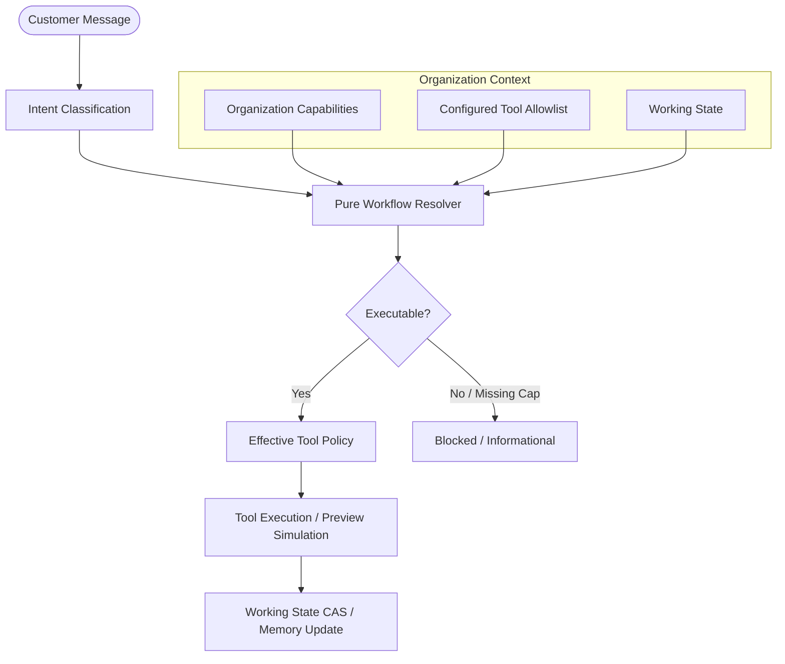

# MB-10 — GENERIC WORKFLOW / INTENT LAYER IMPLEMENTATION

## Status: CLOSED

## 1. Executive Summary

MB-10 establishes a generic, explicit, and capability-driven **Intent + Workflow Orchestration Layer** for the AI Sales Agent. It unties the agent from dental-specific or booking-only assumptions without introducing heavy BPMN machinery, visual DSLs, or `businessType` runtime branching.

Key Accomplishments:
- **Three-Tier Architecture**:
  1. **Intent**: What the customer is trying to achieve (`AgentIntent`: 17 generic types, e.g. `BOOKING_INTENT`, `OFFER_INQUIRY`, `QUOTE_INTENT`, `PURCHASE_INTENT`).
  2. **Workflow**: Which journey is authorized to handle the intent (`WorkflowDefinition`, `WorkflowId`: `DISCOVERY`, `LEAD_CAPTURE`, `BOOKING`, `OFFER_DISCOVERY`, `POLICY_LOOKUP`, `KNOWLEDGE_LOOKUP`, `HUMAN_HANDOFF`, `GENERAL_SUPPORT`, `QUOTE`, `PURCHASE`).
  3. **Workflow State**: Compact operational state tracked across turns (`activeIntent`, `activeWorkflow`, `suspendedWorkflow`, `lastCompletedWorkflow`, `candidateSlots`, `selectedEntity`).
- **Intent != Action**: LLM proposes intent and tool requests, but backend strictly validates capability requirements, state preconditions, and authorizes tool execution.
- **Topic Switching (Suspend & Resume)**: Read-only inquiries (e.g. asking about discounts or cancellation policies) suspend in-flight transactional workflows (e.g. `BOOKING`) without discarding `candidateSlots` or `selectedEntity`. Resuming booking seamlessly recovers state.
- **State Dependency Invalidation**: Selecting a different service or explicit abandonment automatically clears stale `candidateSlots`.
- **Future-Proofing without Premature Execution**: `QUOTE_INTENT` and `PURCHASE_INTENT` are recognized in the taxonomy, but resolved as `supported: true, executable: false, reason: 'WORKFLOW_NOT_IMPLEMENTED'` until MB-12.
- **Zero Regressions**: Proven booking lifecycle, lead policies, offers, business policies, knowledge retrieval, and preview isolation remain fully verified.

---

## 2. Intent Taxonomy & Workflow Registry

### Registered Workflows

| Workflow ID | Supported Intents | Required Capabilities | Allowed Tools | Executable |
|---|---|---|---|---|
| `DISCOVERY` | `DISCOVERY`, `CATALOG_INQUIRY`, `PRICE_INQUIRY` | *None (core)* | `searchServices`, `getServiceDetails`, `getServicePrice` | YES |
| `LEAD_CAPTURE` | `LEAD_INTENT` | `supportsLeads` | `ensureLead`, `updateLeadQualification`, `getLead`, `transitionLead`, `getCustomer`, `createCustomer`, `searchServices` | YES |
| `BOOKING` | `BOOKING_INTENT` | `supportsBooking` | `searchServices`, `getServiceDetails`, `getServicePrice`, `getAvailableSlots`, `createBooking`, `getBookings`, `ensureLead`, `getCustomer`, `createCustomer` | YES |
| `BOOKING_CANCELLATION` | `BOOKING_CANCEL_INTENT` | `supportsBooking` | `getBookings`, `cancelBooking`, `getEffectivePolicy` | YES |
| `BOOKING_RESCHEDULING` | `BOOKING_RESCHEDULE_INTENT` | `supportsBooking` | `getBookings`, `getAvailableSlots`, `rescheduleBooking`, `getEffectivePolicy` | YES |
| `OFFER_DISCOVERY` | `OFFER_INQUIRY` | `supportsOffers` | `getActiveOffers`, `searchServices`, `getServicePrice` | YES |
| `POLICY_LOOKUP` | `POLICY_INQUIRY` | *None (core)* | `getEffectivePolicy` | YES |
| `KNOWLEDGE_LOOKUP` | `KNOWLEDGE_INQUIRY` | *None (core)* | `searchKnowledge` | YES |
| `HUMAN_HANDOFF` | `HANDOFF_REQUEST`, `SUPPORT_REQUEST` | *None (core)* | `handoffToHuman` | YES |
| `GENERAL_SUPPORT` | `GENERAL_INQUIRY`, `UNKNOWN`, `FOLLOW_UP_INTENT` | *None (core)* | `searchServices`, `getServiceDetails`, `getActiveOffers`, `getEffectivePolicy`, `searchKnowledge`, `getFollowUps` | YES |
| `QUOTE` | `QUOTE_INTENT` | `supportsQuotes` | *None (reserved for MB-12)* | NO (Recognized) |
| `PURCHASE` | `PURCHASE_INTENT` | `supportsOrders` | *None (reserved for MB-12)* | NO (Recognized) |

---

## 3. Effective Tool Gating Rule

Effective tool authorization is computed as the strict mathematical intersection:

$$\text{EffectiveTools} = \text{GLOBAL\_REGISTRY} \cap \text{ORGANIZATION\_CAPABILITIES} \cap \text{WORKFLOW\_ALLOWED\_TOOLS} \cap \text{EXECUTION\_MODE} \cap \text{ACTION\_GATE}$$

Any tool not present in this intersection is unconditionally rejected with fail-closed semantics.

---

## 4. Verification Matrix

| Test Suite | Focus Areas | Result |
|---|---|---|
| `@ai-sales-agent/contracts` | `AgentIntentEnum`, `WorkflowIdEnum`, `WorkflowStageEnum`, `IntentClassificationSchema` | PASS |
| `@ai-sales-agent/agent-core` | `WORKFLOW_DEFINITIONS`, `resolveWorkflow`, capability requirements, stage derivation | PASS |
| `@ai-sales-agent/agent-adapters` | Topic switching (suspend/resume), selection change invalidation, workflow abandonment | PASS |
| Full Workspace Build | All 8 packages & 3 apps compiled cleanly | PASS |
| Demo Reseed | Clean reset + seed of demo tenant | PASS |
