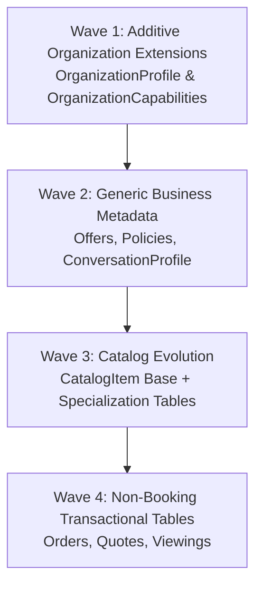

# Multi-Business Platform — Migration Strategy

> This document details the step-by-step, zero-downtime migration strategy transitioning the platform from a dental-first system to a generic multi-business architecture while preserving 100% backward compatibility with existing verified booking functionality.

---

## 1. Core Migration Principles

1. **Non-Breaking First:** Existing tables, columns, routes, and adapter contracts remain functional until all dependencies are safely migrated.
2. **Additive-Only Database Changes:** Never drop or rename columns in initial migrations. Introduce new columns as nullable or with safe default values.
3. **Dual-Read / Dual-Write Where Necessary:** When transitioning from single-table models (e.g., `Service`) to unified catalog models (`CatalogItem`), support both representations during the transition window.
4. **Tenant Isolation Intact:** RLS policies are applied simultaneously to new tables in the same migration file that creates them.
5. **Continuous Verification:** The existing DeepSeek E2E booking verification test suite (`tests/e2e/booking-flow.spec.ts` and `demo-docker.ts`) serves as a mandatory gate for all PRs.

---

## 2. Database Migration Sequencing

The database migration is divided into four distinct waves to avoid disruptive schema shifts:



### Wave 1: Additive Organization Extensions (MB-01)
* **Tables Created/Modified:**
  - Create `organization_profiles` (slug, display_name, legal_name, phone, address, timezone, currency, website, social_links).
  - Create `organization_capabilities` (boolean capability flags + JSON config).
* **Data Backfill:**
  - Migration script inserts default `organization_profiles` and `organization_capabilities` for all existing organizations (seeded with clinic defaults: `supportsBooking=true`, `supportsServices=true`, `supportsLeads=true`, `supportsOffers=true`, `supportsKnowledge=true`).
* **Compatibility:** Existing `organizations` table columns remain untouched.

### Wave 2: Generic Business Metadata (MB-05, MB-06, MB-07)
* **Tables Created:**
  - Create `business_policies` (organization_id, policy_type, title, description, terms, rules_json, is_active).
  - Create `offers` (organization_id, title, description, code, discount_type, discount_value, min_spend, valid_from, valid_to, is_active).
  - Create `conversation_profiles` (organization_id, language, dialect, tone, response_length, formality, emoji_usage, custom_rules).
* **Compatibility:** New tables are additive; Context Builder falls back gracefully if records do not yet exist for an organization.

### Wave 3: Catalog Evolution (MB-04)
* **Schema Evolution Strategy:**
  - Option A (Selected): Keep `services` table active. Introduce `catalog_items` as a unifying base table with foreign key references to `services`, `products`, `listings`.
  - Alternatively, add `type` (`SERVICE`, `PRODUCT`, `LISTING`) to `catalog_items` and create views for backward compatibility.
* **Data Backfill:**
  - Automatically generate a corresponding `catalog_items` record for every existing `services` row.
* **Compatibility:** Existing booking engine and tools continue querying `services` directly or via a backward-compatible adapter interface.

### Wave 4: Non-Booking Transactional Models (MB-12)
* **Tables Created:**
  - Create `orders` & `order_items`
  - Create `quotes` & `quote_items`
* **Compatibility:** Completely decoupled from the `bookings` table.

---

## 3. Runtime & AI Context Migration

### Context Builder Compatibility
The context builder evolves incrementally:
```typescript
// Backward-compatible capability resolution
export function resolveOrgCapabilities(org: OrganizationWithProfile): OrganizationCapabilities {
  if (org.capabilities) {
    return org.capabilities;
  }
  // Default legacy fallback for unmigrated organizations:
  return {
    supportsBooking: true,
    supportsServices: true,
    supportsLeads: true,
    supportsOffers: true,
    supportsKnowledge: true,
    supportsOrders: false,
    supportsQuotes: false,
    supportsListings: false,
  };
}
```

### Dynamic Tool Registration
Agent tools are registered dynamically per conversation session based on the organization's resolved capabilities:
- `supportsBooking === true` ➔ Register `search_available_slots`, `book_appointment`, `cancel_booking`
- `supportsOrders === true` ➔ Register `create_order`, `get_order_status`
- `supportsQuotes === true` ➔ Register `generate_quote`

If an organization lacks a capability, the corresponding tool definitions are omitted from the LLM tool manifest, preventing hallucinated tool calls.

---

## 4. Demo Fixtures & Seed Data Migration

Existing demo environments rely on fixture scripts (e.g., `seed.ts`, `demo-docker.ts`).

### Migration Plan for Fixtures:
1. **Preserve Dental Clinic Fixture:** The existing dental clinic seed (`Al-Noor Dental Clinic`) is retained as the standard reference benchmark for regression testing.
2. **Add Multi-Business Demo Fixtures:**
   - `demo-salon` (Beauty & Hair Salon preset)
   - `demo-realestate` (Property Agency preset)
   - `demo-ecommerce` (Retail Store preset)
3. **Fixture Upgrade Script:** Update `scripts/demo/` scripts to populate `organization_profiles`, `organization_capabilities`, `conversation_profiles`, and `business_policies` during container bootstrap.

---

## 5. Frontend & Dynamic Dashboard Migration

The dashboard moves from hardcoded navigation items to capability-driven navigation:

```typescript
// Navigation config driven by capabilities
export function getSidebarNavigation(capabilities: OrganizationCapabilities) {
  const items = [
    { label: 'Overview', href: '/dashboard', visible: true },
    { label: 'Conversations', href: '/dashboard/conversations', visible: true },
    { label: 'Customers', href: '/dashboard/customers', visible: true },
    { label: 'Leads', href: '/dashboard/leads', visible: capabilities.supportsLeads },
    { label: 'Services', href: '/dashboard/services', visible: capabilities.supportsServices && !capabilities.supportsProducts },
    { label: 'Catalog', href: '/dashboard/catalog', visible: capabilities.supportsProducts || capabilities.supportsListings },
    { label: 'Bookings', href: '/dashboard/bookings', visible: capabilities.supportsBooking },
    { label: 'Orders', href: '/dashboard/orders', visible: capabilities.supportsOrders },
    { label: 'Offers', href: '/dashboard/offers', visible: capabilities.supportsOffers },
    { label: 'Knowledge Base', href: '/dashboard/knowledge', visible: capabilities.supportsKnowledge },
    { label: 'AI Assistant Settings', href: '/dashboard/settings/ai', visible: true },
    { label: 'Analytics', href: '/dashboard/analytics', visible: true },
  ];
  return items.filter(item => item.visible);
}
```

---

## 6. Rollback & Disaster Recovery Strategy

Each phase must include a documented rollback path:

| Phase | Rollback Trigger | Rollback Procedure |
|---|---|---|
| **MB-01 (Org Profiles & Capabilities)** | Context builder crashes on missing capability record | Code rollback to default fallback resolver. Migrations are additive, no DB rollback needed. |
| **MB-04 (Generic Catalog)** | Booking tool fails to resolve service details | Revert tool queries to direct `services` table queries. |
| **MB-05/06/07 (Offers/Policies/Style)** | Prompt bloat or degraded LLM response quality | Disable offer/policy prompt injection via feature flag; assistant reverts to base persona prompt. |
| **MB-10 (Workflow Layer)** | Intent classification loops or misroutes | Revert to direct tool-based intent handling in core runtime. |

---

## 7. Verification & Acceptance Gates

Before any multi-business phase is considered closed:

1. **Unit & Integration Test Suite:** 100% pass on all existing backend tests (`npm test`).
2. **DeepSeek Booking E2E:** Automated execution of `demo-docker.ts` / E2E test verifying full WhatsApp/Chat booking flow from greeting to slot reservation to post-booking finalization.
3. **Multi-Tenant Isolation Check:** Automated test confirming that queries under Tenant B cannot view Tenant A's catalog, policies, or bookings.
4. **Performance Gate:** Context building and prompt generation latency must remain under 150ms.
