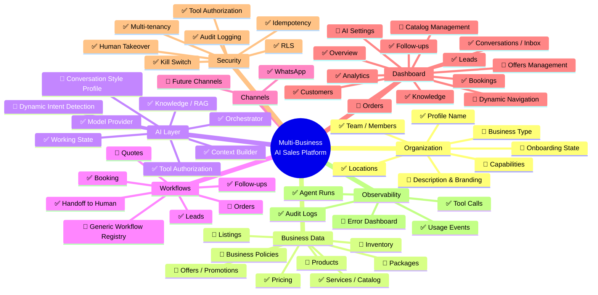
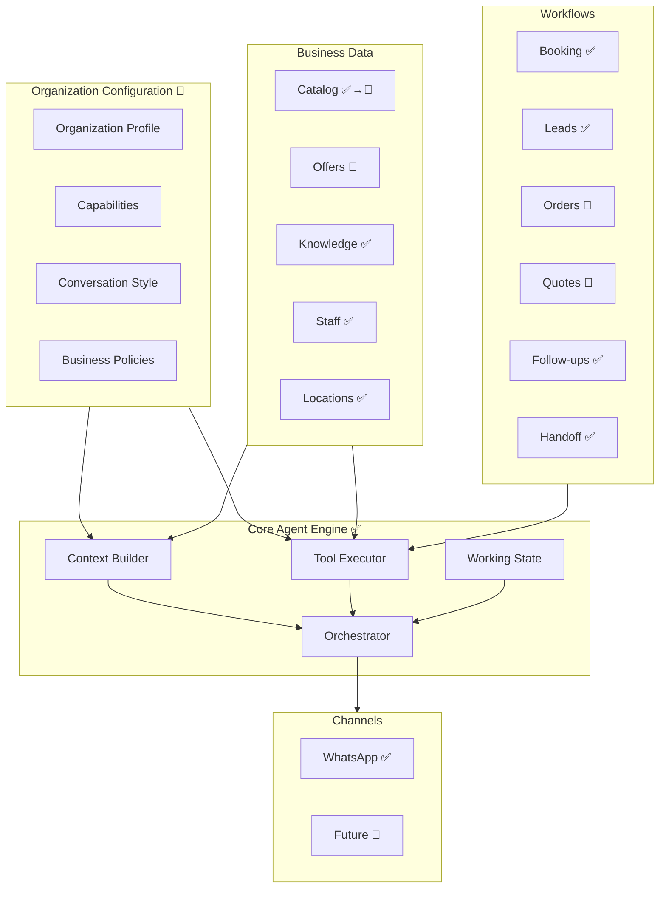

# Multi-Business Platform — Mind Map

> Visual map of the entire platform surface. Items marked ✅ exist today; items marked 🔮 are future phases.

---

## System Overview

---

## Capability-Driven Architecture Map

---

## Module Status Legend

| Symbol | Meaning |
|--------|---------|
| ✅ | Exists and is production-proven |
| 🔮 | Future phase — planned but not implemented |
| ✅→🔮 | Exists but requires generalization |
