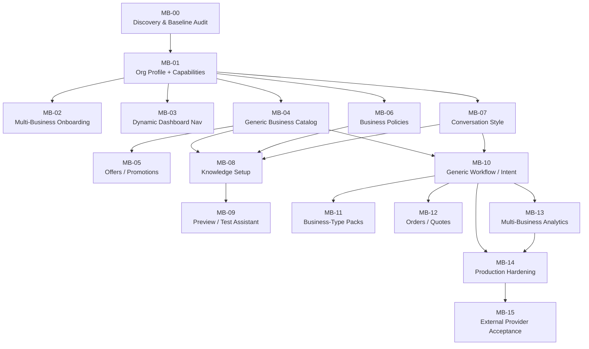

# Multi-Business Platform — Roadmap

> Each phase has a clear objective, scope boundary, dependencies, and acceptance criteria.
> Phases are ordered by dependency — not by business priority alone.

---

## Phase Index

| Phase | Name | Status | Dependencies |
| MB-00 | Discovery & Baseline Audit | CLOSED | — |
| MB-01 | Organization Profile + Capabilities | CLOSED | MB-00 |
| MB-02 | Multi-Business Onboarding | CLOSED | MB-01 |
| MB-03 | Dynamic Dashboard Navigation | CLOSED | MB-01 |
| MB-04 | Generic Business Catalog | CLOSED | MB-01 |
| MB-05 | Offers / Promotions | CLOSED | MB-04 |
| MB-06 | Business Policies | CLOSED | MB-01 |
| MB-07 | Conversation Style & Assistant Personality | CLOSED | MB-01 |
| MB-08 | Knowledge Setup | CLOSED | MB-04, MB-06, MB-07 |
| MB-09 | Preview / Test Assistant | CLOSED | MB-08 |
| MB-10 | Generic Workflow / Intent Layer | CLOSED | MB-04, MB-07 |
| MB-11 | Business-Type Packs / Templates | CLOSED | MB-10 |
| MB-12 | Orders / Quotes / Non-Booking Transactions | CLOSED | MB-10 |
| MB-13 | Multi-Business Analytics | CLOSED | MB-10, MB-12 |
| MB-14 | Production Hardening & Migration | CLOSED | MB-10, MB-13 |
| MB-15 | External / Live Provider Acceptance | NEXT | MB-14 |

---

## MB-00 — Discovery & Baseline Audit

**Objective:** Audit the current repository, map existing modules to reusable/generalizable/dental-specific categories, and produce the planning documentation set.

**Scope:**
- Repository inspection of all packages, apps, schema, tools, and context builder
- Mapping of every module to REUSABLE_AS_IS / REQUIRES_GENERALIZATION / DENTAL_SPECIFIC / FUTURE_MODULE
- Creation of the `docs/multi-business-platform/` documentation set

**Dependencies:** None

**Deliverables:**
- This documentation folder with all planning documents
- Current system mapping (see below in this document)
- Phase dependency graph

**Data-model impact:** None — documentation only
**Backend impact:** None
**Frontend impact:** None
**AI/context impact:** None
**Tests:** N/A — planning only

**Acceptance criteria:**
- [ ] All planning documents exist and are internally consistent
- [ ] Current system mapping is complete and repository-verified
- [ ] Phase dependency graph matches actual module dependencies

**Out-of-scope:** Implementation, migrations, code changes
**Rollback:** Delete `docs/multi-business-platform/`
**Risks:** Low — documentation-only phase

---

## MB-01 — Organization Profile + Capabilities

**Objective:** Extend Organization with a profile (business type metadata, description, branding) and a structured capabilities model that drives runtime behavior.

**Scope:**
- New `OrganizationProfile` fields or table
- New `OrganizationCapabilities` (structured JSON or relational)
- API endpoints to read/update profile and capabilities
- Seed/demo fixture updates

**Dependencies:** MB-00

**Deliverables:**
- Organization profile schema + API
- Capability flags (supportsBooking, supportsLeads, supportsOrders, etc.)
- Default capability templates per business type (for onboarding convenience — NOT for runtime branching)

**Data-model impact:**
- Extend `Organization` or add `OrganizationProfile` table
- Add `OrganizationCapabilities` (JSONB column or table)

**Backend impact:**
- New CRUD endpoints for profile/capabilities
- AgentConfig may reference capability constraints

**Frontend impact:**
- Settings page for organization profile
- Capability toggles (progressive disclosure)

**AI/context impact:**
- Context builder reads organization profile to set persona
- Tool allowlist may auto-derive from capabilities

**Tests:**
- Unit: capability CRUD
- Integration: capability affects tool allowlist derivation
- RLS: profile/capability isolation per org

**Acceptance criteria:**
- [ ] Organization can set business type, description, and capabilities
- [ ] Capabilities are queryable at runtime
- [ ] Default capability set for "dental clinic" matches current behavior
- [ ] RLS prevents cross-org access
- [ ] No runtime `if businessType === X` branching

**Out-of-scope:** Dashboard navigation changes, catalog generalization
**Rollback:** Drop new columns/table; restore old Organization model
**Risks:** Over-engineering capability flags; see RISKS.md

---

## MB-02 — Multi-Business Onboarding

**Objective:** Build a guided onboarding wizard that progressively collects business identity, capabilities, catalog, policies, and style before going live.

**Scope:**
- Multi-step onboarding flow (business identity → capabilities → catalog → policies → knowledge → style → channel → test → go live)
- Save-and-resume support
- Onboarding progress tracking

**Dependencies:** MB-01

**Deliverables:**
- Onboarding wizard UI
- Onboarding state persistence
- "Setup completeness" indicator

**Data-model impact:**
- Onboarding progress tracking (JSONB or table)

**Backend impact:**
- Onboarding status API
- Validation for minimum-viable setup

**Frontend impact:**
- Multi-step wizard with progressive disclosure
- Mobile/RTL friendly

**AI/context impact:** None directly — sets up data consumed by later phases

**Tests:**
- E2E: complete onboarding flow for 2+ business types
- Responsive/RTL visual testing

**Acceptance criteria:**
- [ ] New organization can complete onboarding for dental, salon, and ecommerce scenarios
- [ ] Onboarding state persists across sessions
- [ ] Missing setup steps are clearly indicated
- [ ] Arabic/RTL layout works

**Out-of-scope:** Actual catalog/offer CRUD (those are in MB-04, MB-05)
**Rollback:** Remove wizard; revert to current direct-settings approach
**Risks:** UX complexity; must use strong defaults

---

## MB-03 — Dynamic Dashboard Navigation

**Objective:** Dashboard navigation renders dynamically based on organization capabilities rather than showing a static list.

**Scope:**
- Replace static `OperatorNav` with capability-driven navigation
- Modules appear/disappear based on `supportsBooking`, `supportsOrders`, etc.
- "Coming soon" indicators for unconfigured capabilities

**Dependencies:** MB-01

**Deliverables:**
- Dynamic navigation component
- Navigation configuration schema (capability → nav items)
- Feature flag for gradual rollout

**Data-model impact:** None (reads capabilities)
**Backend impact:** Capabilities API (from MB-01) serves nav configuration
**Frontend impact:** Replace `OperatorNav.tsx`

**AI/context impact:** None

**Tests:**
- Unit: nav renders correct items per capability set
- Snapshot: dental vs. salon vs. ecommerce nav layouts

**Acceptance criteria:**
- [ ] Dental org sees: Dashboard, Inbox, Leads, Bookings, Follow-ups, Knowledge, Channels, Templates, Analytics
- [ ] Salon org sees: Dashboard, Inbox, Customers, Bookings, Services, Offers, Staff, Knowledge, AI Settings, Analytics
- [ ] Ecommerce org sees: Dashboard, Inbox, Customers, Products, Orders, Offers, Knowledge, AI Settings, Analytics
- [ ] No navigation item appears for disabled capabilities

**Out-of-scope:** Building the actual pages for new nav items
**Rollback:** Revert to static `OperatorNav`
**Risks:** Navigation sprawl; keep max ~12 items

---

## MB-04 — Generic Business Catalog

**Objective:** Evolve the current `Service` model toward a generic catalog that can represent services, products, listings, and packages.

**Scope:**
- Evaluate `CatalogItem` abstraction vs. `Service` extension
- Support catalog item types: SERVICE, PRODUCT, LISTING, PACKAGE
- Maintain backward compatibility with existing `Service` table and booking pipeline
- Generic catalog CRUD API
- Dashboard catalog management page

**Dependencies:** MB-01

**Deliverables:**
- Generalized catalog schema
- Catalog API (CRUD + search)
- Catalog dashboard page
- Migration from `Service` → `CatalogItem` (or compatible extension)

**Data-model impact:**
- REQUIRES AUDIT — see DOMAIN-MODEL.md for migration options
- Likely new `catalog_items` table or extension of `services`
- Must preserve FK integrity with `bookings`, `leads`, `service_staff`

**Backend impact:**
- New catalog endpoints
- Tool executor's `searchServices` evolves to `searchCatalog`

**Frontend impact:**
- Generic catalog management page
- Item type selector

**AI/context impact:**
- `searchServices` tool becomes `searchCatalog` (backward compatible alias)
- Context builder references "catalog items" not "dental services"

**Tests:**
- Unit: catalog CRUD
- Integration: booking still works with SERVICE-type catalog items
- Migration: existing Service data accessible through new model
- RLS: tenant isolation

**Acceptance criteria:**
- [ ] New catalog items can be created for SERVICE, PRODUCT, LISTING types
- [ ] Existing `Service` data remains accessible and bookable
- [ ] `searchServices` tool continues to work (alias or adapter)
- [ ] Catalog search returns results across item types

**Out-of-scope:** Inventory management, pricing tiers
**Rollback:** Revert migration; restore Service-only model
**Risks:** Breaking existing booking FK chain — see RISKS.md

---

## MB-05 — Offers / Promotions

**Objective:** Add a generic offer/promotion model that is backend-authoritative (AI must not invent promotions).

**Scope:**
- Offer types: percentage discount, fixed discount, bundle, limited-time, item-specific, customer-eligible
- Offer CRUD API
- Offer context injection for AI
- Dashboard offer management

**Dependencies:** MB-04

**Deliverables:**
- `Offer` table and API
- AI tool: `getActiveOffers` (read-only)
- Dashboard offers page

**Data-model impact:** New `Offer` table
**Backend impact:** Offer CRUD + validation logic
**Frontend impact:** Offer management page
**AI/context impact:** New read-only tool; context builder includes active offers

**Tests:**
- Unit: offer validation, eligibility
- Integration: AI can present offers but not fabricate them
- RLS: tenant isolation

**Acceptance criteria:**
- [ ] Offers can be created, activated, deactivated, and expired
- [ ] AI can query and present active offers
- [ ] AI cannot create or modify offers
- [ ] Offers are scoped to catalog items or org-wide

**Out-of-scope:** Payment integration, coupon codes
**Rollback:** Drop `Offer` table; remove tool
**Risks:** Offer complexity explosion; start simple

---

## MB-06 — Business Policies

**Objective:** Add configurable, structured business policies (booking, cancellation, refund, delivery, etc.) distinct from knowledge-base content.

**Scope:**
- Structured policy model (machine-readable rules)
- Policy types: booking, cancellation, refund, delivery, returns, payment, minimum order, service area, advance booking, handoff
- API to manage policies
- AI tool: `getBusinessPolicies` (read-only)

**Dependencies:** MB-01

**Deliverables:**
- `BusinessPolicy` table
- Policy CRUD API
- AI read-only tool

**Data-model impact:** New `BusinessPolicy` table
**Backend impact:** Policy CRUD, validation, enforcement integration
**Frontend impact:** Policy management page
**AI/context impact:** Policies retrieved on demand with `getEffectivePolicy`; enforceable rules remain backend-authoritative

**Tests:**
- Integration: policy enforcement on booking/cancellation
- AI cannot override policies

**Acceptance criteria:**
- [x] Policies are structured, machine-readable, and applicable current workflows are backend-enforced
- [x] AI presents policy information but cannot override rules
- [x] Human-readable summaries remain separate from structured transactional truth

**Out-of-scope:** Automated policy enforcement for non-booking workflows (deferred to MB-10)
**Rollback:** Drop `BusinessPolicy` table
**Risks:** Policy conflict resolution; keep enforcement simple

---

## MB-07 — Conversation Style & Assistant Personality

**Objective:** Organization-level conversation profile that controls AI tone, language, and behavior without making the assistant robotic.

**Scope:**
- Conversation profile: language, dialect, tone, formality, response length, sales pressure, emoji preference, handoff style
- Profile stored per organization
- Context builder reads profile to set persona dynamically

**Dependencies:** MB-01

**Deliverables:**
- `ConversationProfile` configuration (JSONB on Organization or separate table)
- Context builder generalization
- Dashboard AI Settings page

**Data-model impact:** New column or table on Organization
**Backend impact:** Profile CRUD API

**Frontend impact:** AI Settings page with personality sliders/selectors

**AI/context impact:**
- **Core change:** `context-builder.ts` reads organization profile instead of hardcoded dental persona
- `POLICY_BLOCK` becomes dynamic
- `WORKFLOW_GUIDANCE` becomes capability-driven

**Tests:**
- Unit: context builder produces correct persona per profile
- Integration: different orgs get different assistant personalities
- Guardrail: AI still respects backend authority regardless of style

**Acceptance criteria:**
- [x] Two organizations with different profiles produce different system prompts
- [x] Dental clinic profile produces behavior equivalent to current hardcoded prompt
- [x] LLM controls phrasing; backend controls facts and permissions
- [x] No profile setting can override backend safety (kill switch, tool auth, RLS)

**Out-of-scope:** Per-conversation style overrides
**Rollback:** Revert context builder to hardcoded dental prompt
**Risks:** Prompt injection via style fields — sanitize inputs

---

## MB-08 — Knowledge Setup

**Objective:** Guided knowledge configuration that works for any business type — auto-suggest knowledge categories based on capabilities.

**Scope:**
- Knowledge document categorization (FAQ, service descriptions, policies, general)
- Suggested knowledge templates per business type
- Integration with capability-aware context builder

**Dependencies:** MB-04, MB-06, MB-07

**Deliverables:**
- Knowledge categorization schema
- Suggested template content per business type
- Enhanced knowledge management UI

**Data-model impact:** Optional category field on `KnowledgeDocument`
**Backend impact:** Category-aware knowledge search
**Frontend impact:** Enhanced knowledge management with suggestions

**AI/context impact:** Context builder may prioritize knowledge by category

**Tests:**
- Knowledge search still works
- Category filtering works

**Acceptance criteria:**
- [ ] Knowledge documents can be categorized
- [ ] Business type suggests relevant knowledge categories
- [ ] Existing uncategorized knowledge continues to work

**Out-of-scope:** Advanced RAG improvements, multi-language knowledge
**Rollback:** Remove category field; revert to uncategorized
**Risks:** Low — additive change

---

## MB-09 — Preview / Test Assistant

**Objective:** Business owners can preview and test their AI assistant before going live.

**Scope:**
- Sandbox conversation mode
- Preview uses real organization config but does not affect production data
- Test conversation UI in dashboard

**Dependencies:** MB-08

**Deliverables:**
- Sandbox conversation endpoint
- Preview chat UI
- Test report (what the assistant can/cannot do)

**Data-model impact:** Sandbox flag on conversations or separate sandbox store
**Backend impact:** Sandbox execution path (tools execute in dry-run)
**Frontend impact:** Preview chat component in dashboard

**AI/context impact:** Same orchestrator, sandboxed tool execution

**Tests:**
- Sandbox bookings don't create real records
- Preview shows accurate assistant behavior

**Acceptance criteria:**
- [ ] Business owner can chat with their assistant in preview mode
- [ ] No production data is created
- [ ] Preview reflects current configuration

**Out-of-scope:** Automated testing suites, regression testing
**Rollback:** Remove preview endpoint and UI
**Risks:** Sandbox leakage — must enforce sandbox flag through entire tool chain

---

## MB-10 — Generic Workflow / Intent Layer

**Objective:** Replace hardcoded booking workflow guidance with a capability-driven workflow registry.

**Scope:**
- Workflow definitions: booking, ordering, quoting, inquiry, etc.
- Intent detection driven by capabilities (not by business type)
- Context builder assembles workflow guidance dynamically
- Tool allowlist derived from active workflows

**Dependencies:** MB-04, MB-07

**Deliverables:**
- Workflow registry
- Dynamic context builder (replaces `WORKFLOW_GUIDANCE`)
- Capability → workflow → tool mapping

**Data-model impact:** Workflow definitions (config or table)
**Backend impact:** Workflow registry; dynamic tool allowlist
**Frontend impact:** None (backend/AI layer)

**AI/context impact:**
- **Major change:** `WORKFLOW_GUIDANCE` in `context-builder.ts` becomes dynamic
- Per-org, per-capability workflow instructions

**Tests:**
- Booking workflow unchanged for dental org
- New workflows work for salon/ecommerce
- No workflow activated without matching capability

**Acceptance criteria:**
- [ ] Dental org produces identical agent behavior to current system
- [ ] Salon org gets booking + lead workflows
- [ ] Ecommerce org gets ordering workflow
- [ ] No workflow guidance emitted for disabled capabilities

**Out-of-scope:** Custom workflow builder UI
**Rollback:** Revert to hardcoded `WORKFLOW_GUIDANCE`
**Risks:** Prompt explosion — must budget context window carefully

---

## MB-11 — Business-Type Packs / Templates

**Objective:** Pre-built configuration templates for common business types (dental, salon, real estate, etc.).

**Scope:**
- Template packs: capability presets, sample catalog items, sample policies, conversation style, knowledge suggestions
- One-click setup from template during onboarding
- Templates are starting points, not constraints

**Dependencies:** MB-10

**Deliverables:**
- Template pack definitions (seed data or config)
- Template selection in onboarding wizard
- Post-template customization

**Data-model impact:** Template pack storage (config files or seed table)
**Backend impact:** Template application API
**Frontend impact:** Template picker in onboarding

**AI/context impact:** None directly — templates set configuration that AI reads

**Tests:**
- Each template produces valid configuration
- Template doesn't lock out customization

**Acceptance criteria:**
- [ ] At least 3 template packs exist (dental, salon, ecommerce)
- [ ] Applying a template sets capabilities, suggested catalog structure, and style
- [ ] All template-set values can be overridden

**Out-of-scope:** User-created custom templates
**Rollback:** Remove template picker; manual configuration only
**Risks:** Templates becoming stale; must version them

---

## MB-12 — Orders / Quotes / Non-Booking Transactions

**Objective:** Support transaction types beyond booking — orders (ecommerce), quotes (professional services), viewings (real estate).

**Scope:**
- Generic transaction model
- Order workflow (cart → order → fulfillment)
- Quote workflow (request → quote → accept/reject)
- Transaction-type-specific tools
- Dashboard transaction views

**Dependencies:** MB-10

**Deliverables:**
- `Order` table and API
- `Quote` table and API
- AI tools: `createOrder`, `createQuote`, etc.
- Dashboard pages per transaction type

**Data-model impact:** New `Order`, `Quote` tables
**Backend impact:** Transaction CRUD + workflow enforcement
**Frontend impact:** Order/quote management pages

**AI/context impact:** New tools and workflow guidance for order/quote flows

**Tests:**
- E2E: order creation via AI conversation
- E2E: quote request via AI conversation
- Booking workflow unaffected

**Acceptance criteria:**
- [ ] Ecommerce org can process orders through AI
- [ ] Professional services org can generate quotes through AI
- [ ] Booking workflow remains unchanged for dental/salon orgs

**Out-of-scope:** Payment processing, inventory management
**Rollback:** Drop new tables; remove tools
**Risks:** Transaction complexity; start with simple order flow

---

## MB-13 — Multi-Business Analytics

**Objective:** Analytics dashboard adapts to show metrics relevant to organization capabilities.

**Scope:**
- Capability-aware analytics views
- Booking analytics (existing)
- Order analytics (new)
- Lead analytics (existing, generalized)
- Conversation analytics (existing)
- AI performance metrics (existing)

**Dependencies:** MB-10

**Deliverables:**
- Dynamic analytics dashboard
- Capability-filtered metrics
- Export functionality

**Data-model impact:** None (reads existing + new transaction data)
**Backend impact:** Analytics query service generalization
**Frontend impact:** Dynamic analytics components

**AI/context impact:** None

**Tests:**
- Analytics renders correctly per capability set
- Data accuracy

**Acceptance criteria:**
- [ ] Dental org sees booking + lead analytics
- [ ] Ecommerce org sees order + lead analytics
- [ ] All orgs see conversation + AI performance metrics

**Out-of-scope:** Custom report builder, real-time dashboards
**Rollback:** Revert to current static analytics
**Risks:** Low — read-only aggregation

---

## MB-14 — Production Hardening & Migration

**Objective:** Full regression testing, performance validation, migration tooling, and backward compatibility verification.

**Scope:**
- Full regression suite against dental-first behavior
- Performance testing under multi-business load
- Migration tooling for existing dental orgs
- Feature flag cleanup
- Documentation finalization

**Dependencies:** MB-10, MB-13

**Deliverables:**
- Regression test suite
- Performance benchmarks
- Migration scripts
- Deployment runbook

**Data-model impact:** Migration scripts for existing data
**Backend impact:** Feature flag cleanup
**Frontend impact:** Feature flag cleanup

**AI/context impact:** Verification of prompt quality across business types

**Tests:**
- Full regression: all existing E2E tests pass
- Performance: multi-org concurrent load
- Migration: existing dental org data survives migration

**Acceptance criteria:**
- [ ] All existing tests pass
- [ ] Dental org behavior is identical pre/post migration
- [ ] No performance degradation
- [ ] Rollback tested and documented

**Out-of-scope:** New feature development
**Rollback:** Full rollback plan documented and tested
**Risks:** Migration data loss — tested rollback required

---

## MB-15 — External / Live Provider Acceptance

**Objective:** Live validation with real external providers (WhatsApp, DeepSeek) across multiple business types.

**Scope:**
- Live testing with real WhatsApp Business API
- Multi-business-type live conversations
- Provider acceptance criteria
- External partner onboarding documentation

**Dependencies:** MB-14

**Deliverables:**
- Live test results
- Provider acceptance sign-off
- External onboarding guide

**Data-model impact:** None
**Backend impact:** None
**Frontend impact:** None

**AI/context impact:** Live prompt quality validation

**Tests:**
- Live E2E with real providers
- Multi-business-type conversations

**Acceptance criteria:**
- [ ] Real WhatsApp conversations work for 3+ business types
- [ ] DeepSeek produces quality responses across business types
- [ ] No hallucination of prices/availability
- [ ] Provider rate limits respected

**Out-of-scope:** Additional channel integrations
**Rollback:** N/A — validation phase
**Risks:** Provider API changes; budget for live testing costs

---

## Current System Mapping

| Module | Classification | Notes |
|--------|---------------|-------|
| `agent-core/orchestrator.ts` | REUSABLE_AS_IS | Core loop is business-agnostic |
| `agent-core/context-builder.ts` | REQUIRES_GENERALIZATION | Hardcoded dental persona + workflow |
| `agent-core/ports.ts` | REUSABLE_AS_IS | Interfaces are generic |
| `agent-core/openai-compatible.ts` | REUSABLE_AS_IS | Provider adapter is generic |
| `agent-adapters/tool-executor.ts` | REQUIRES_GENERALIZATION | Tool definitions reference "services" |
| `agent-adapters/booking-tools.ts` | REUSABLE_AS_IS | Becomes capability-gated |
| `agent-adapters/lead-tools.ts` | REUSABLE_AS_IS | Already generic |
| `agent-adapters/service-search.ts` | REQUIRES_GENERALIZATION | Rename/extend to catalog search |
| `agent-adapters/conversation-working-state.ts` | REUSABLE_AS_IS | State model is generic |
| `agent-adapters/run-conversation-agent.ts` | REUSABLE_AS_IS | Orchestration adapter is generic |
| `contracts/agent.ts` | REQUIRES_GENERALIZATION | Tool name lists need extension |
| `prisma/schema.prisma` — Organization | REQUIRES_GENERALIZATION | Add profile + capabilities |
| `prisma/schema.prisma` — Service | REQUIRES_GENERALIZATION | Evolve to catalog item |
| `prisma/schema.prisma` — Customer | REUSABLE_AS_IS | Already generic |
| `prisma/schema.prisma` — Lead | REUSABLE_AS_IS | Already generic |
| `prisma/schema.prisma` — Booking | REUSABLE_AS_IS | Capability-gated, no change |
| `prisma/schema.prisma` — Knowledge* | REUSABLE_AS_IS | Pipeline is generic |
| `prisma/schema.prisma` — FollowUp | REUSABLE_AS_IS | Already generic |
| `prisma/schema.prisma` — ConversationWorkingState | REUSABLE_AS_IS | Already generic |
| `apps/api` — catalog module | REQUIRES_GENERALIZATION | Extend for generic catalog |
| `apps/api` — bookings module | REUSABLE_AS_IS | Capability-gated |
| `apps/api` — leads module | REUSABLE_AS_IS | Already generic |
| `apps/api` — knowledge module | REUSABLE_AS_IS | Already generic |
| `apps/api` — conversations module | REUSABLE_AS_IS | Already generic |
| `apps/api` — analytics module | REQUIRES_GENERALIZATION | Add capability-aware views |
| `apps/api` — organizations module | REQUIRES_GENERALIZATION | Add profile + capabilities |
| `apps/web` — OperatorNav | REQUIRES_GENERALIZATION | Replace with dynamic nav |
| `apps/web` — dashboard pages | REQUIRES_GENERALIZATION | Add capability-conditional rendering |
| `apps/worker` | REUSABLE_AS_IS | Job processing is generic |
| `packages/embeddings` | REUSABLE_AS_IS | Embedding pipeline is generic |
| `packages/knowledge-chunking` | REUSABLE_AS_IS | Chunking is generic |
| `packages/storage` | REUSABLE_AS_IS | Object storage is generic |
| `demo fixtures/seed` | DENTAL_SPECIFIC | Must add multi-business fixtures |
| `docker-compose.demo.yml` | REUSABLE_AS_IS | Infrastructure is generic |

---

## Phase Dependency Graph

