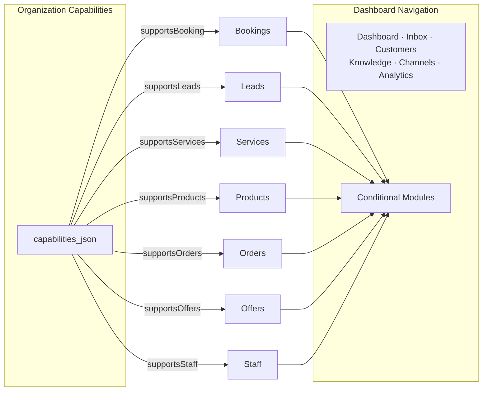

# Multi-Business Platform — UX Principles

> The dashboard should feel simple even if the backend is complex.

---

## Intended Onboarding Flow

```
┌─────────────────────────────────────────────────────┐
│  1. Business Identity                               │
│     Name, type, description, logo, timezone         │
├─────────────────────────────────────────────────────┤
│  2. What should the AI do?                          │
│     Select capabilities (booking, leads, orders...) │
├─────────────────────────────────────────────────────┤
│  3. Services / Products / Business Data             │
│     Add catalog items relevant to your business     │
├─────────────────────────────────────────────────────┤
│  4. Policies / Offers                               │
│     Set booking rules, cancellation, promotions     │
├─────────────────────────────────────────────────────┤
│  5. Teach the Assistant                             │
│     Upload knowledge documents, FAQs                │
├─────────────────────────────────────────────────────┤
│  6. Conversation Style                              │
│     Tone, language, response style                  │
├─────────────────────────────────────────────────────┤
│  7. Connect Channel                                 │
│     WhatsApp Business API setup                     │
├─────────────────────────────────────────────────────┤
│  8. Test Assistant                                  │
│     Preview conversation in sandbox mode            │
├─────────────────────────────────────────────────────┤
│  9. Go Live                                         │
│     Activate the assistant                          │
└─────────────────────────────────────────────────────┘
```

---

## Core UX Principles

### 1. Progressive Disclosure

Show only what's relevant at each step. Don't overwhelm new users with all capabilities at once.

- Onboarding shows one step at a time
- Dashboard shows modules only for enabled capabilities
- Advanced settings hidden behind expandable sections
- "Learn more" links for complex features

### 2. Strong Defaults

Every setting should have an intelligent default so businesses can go live with minimal configuration.

- Default capabilities per business type (e.g., dental → booking + leads + services + staff)
- Default conversation style per locale (e.g., Arabic/Iraqi → friendly, semi-formal)
- Default policies (e.g., 24h advance booking, graceful cancellation)
- Default knowledge suggestions per business type

### 3. Save-and-Resume Onboarding

Business owners should never lose progress. Onboarding state persists across sessions.

- Every step auto-saves
- Resume button on dashboard if onboarding is incomplete
- Clear progress indicator showing completed/remaining steps
- Allow skipping non-essential steps (with "incomplete" indicators)

### 4. No Technical Capability Names

Users see human-friendly descriptions, not developer flag names.

| Internal Flag | User-Facing Label |
|---------------|-------------------|
| `supportsBooking` | "حجز المواعيد" / "Appointment Booking" |
| `supportsLeads` | "إدارة العملاء المحتملين" / "Lead Management" |
| `supportsOrders` | "طلبات المنتجات" / "Product Orders" |
| `supportsQuotes` | "عروض أسعار" / "Price Quotes" |
| `supportsOffers` | "العروض والخصومات" / "Offers & Discounts" |
| `supportsProducts` | "كتالوج المنتجات" / "Product Catalog" |
| `supportsServices` | "الخدمات" / "Services" |
| `supportsStaff` | "إدارة الموظفين" / "Staff Management" |

### 5. Dynamic Dashboard

Dashboard navigation and content adapt to enabled capabilities.

**Example — Dental Clinic:**
```
Dashboard | Inbox | Leads | Bookings | Follow-ups | Knowledge | Channels | Analytics
```

**Example — Salon:**
```
Dashboard | Inbox | Customers | Bookings | Services | Offers | Staff | Knowledge | AI Settings | Analytics
```

**Example — Ecommerce:**
```
Dashboard | Inbox | Customers | Products | Orders | Offers | Knowledge | AI Settings | Analytics
```

**Example — Real Estate:**
```
Dashboard | Inbox | Customers | Leads | Listings | Offers | Knowledge | AI Settings | Analytics
```

### 6. Preview Before Activation

Business owners can test their AI assistant in a sandbox before going live.

- Sandbox chat widget in dashboard
- Simulated customer conversation
- Clear indicator: "Preview Mode — No real data will be created"
- Test report: what the assistant can/cannot do

### 7. Explain Missing Setup

When a feature isn't working, explain why and link to the setup step.

- "Your AI assistant can't book appointments yet because no services have been created. [Set up services →]"
- "Knowledge base is empty. Your assistant will rely on your business description only. [Add knowledge →]"
- "WhatsApp isn't connected. Your assistant is ready but can't receive messages yet. [Connect WhatsApp →]"

### 8. Avoid Overwhelming New Organizations

- Start with minimal required steps (identity + one capability)
- Suggest optional enhancements as "improve your assistant" nudges
- Don't show empty dashboards — show helpful prompts
- Gamify setup completeness (progress bar, checkmarks)

### 9. Mobile-Friendly Admin Experience

- All dashboard pages must be responsive
- Touch-friendly controls
- Minimum tap target: 44×44px
- Collapsible navigation on mobile
- Key actions (inbox, notifications) easily accessible

### 10. Arabic/RTL Compatibility

- Full RTL layout support
- Arabic labels and descriptions for all UI elements
- Iraqi-market-friendly defaults:
  - Default timezone: `Asia/Baghdad`
  - Default currency: `IQD`
  - Default language: `ar`
  - Default dialect: `iraqi`
  - Default formality: `semi_formal`
- **Architecture is NOT Iraq-specific** — these are just defaults that can be changed per org
- English/LTR also fully supported

---

## Dashboard Module Registry

Each dashboard module maps to one or more capabilities:

| Module | Required Capability | Nav Label (EN) | Nav Label (AR) |
|--------|-------------------|----------------|----------------|
| Dashboard | always | Dashboard | لوحة القيادة |
| Inbox | always | Inbox | المحادثات |
| Customers | always | Customers | العملاء |
| Leads | supportsLeads | Leads | العملاء المحتملين |
| Bookings | supportsBooking | Bookings | الحجوزات |
| Catalog (Services) | supportsServices | Services | الخدمات |
| Catalog (Products) | supportsProducts | Products | المنتجات |
| Catalog (Listings) | supportsListings | Listings | العقارات |
| Orders | supportsOrders | Orders | الطلبات |
| Quotes | supportsQuotes | Quotes | عروض الأسعار |
| Offers | supportsOffers | Offers | العروض |
| Staff | supportsStaff | Staff | الموظفين |
| Knowledge | always | Knowledge | قاعدة المعرفة |
| Follow-ups | supportsBooking OR supportsLeads | Follow-ups | المتابعات |
| Channels | always | Channels | القنوات |
| Templates | always | Templates | القوالب |
| AI Settings | always | AI Settings | إعدادات الذكاء |
| Analytics | always | Analytics | التحليلات |

---

## Dynamic Dashboard Example


