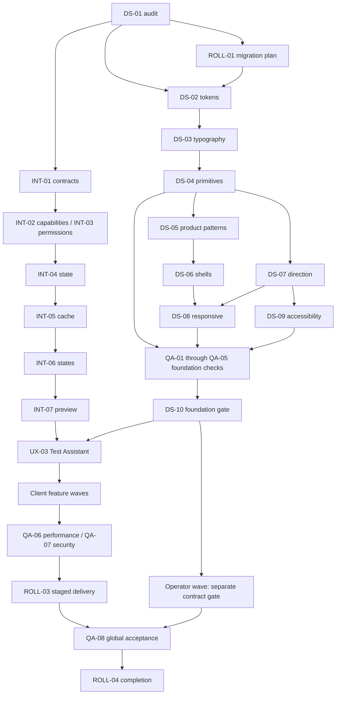

# UI product roadmap

## Vision

Build a calm, professional, Arabic-first multi-business product on the existing AI Sales Agent foundation. Business owners and employees operate daily work in Business Client; separately authorized SaaS operators manage the platform in Platform Admin. Customers have no dashboard. Test Assistant provides useful agent testing without Meta and is the first product milestone after foundations.

## Current state and inspection evidence

Inspected 2026-10-03. This task creates documentation only. The repository already has substantial tenant, capability, catalog, policy, knowledge, transaction, analytics and agent functionality. Existing operational dashboard and MB15 acceptance are reusable baselines, not completion evidence for this new roadmap.

| Verified source | Current behavior | Roadmap consequence |
|---|---|---|
| apps/web/package.json | Next 16.3.6, React 19.1.1, TypeScript 5.9.2, Supabase and shared contracts/config | Check installed Next docs and compatibility before future dependency installation. |
| apps/web/src/app/layout.tsx | Root lang=en, inline styles, no global direction/theme foundation | DS-02/03/07 establish global tokens and locale. |
| Frontend file/config inventory | No components.json, Tailwind setup, global CSS, shadcn primitive tree or proposed query/form/chart/theme libraries found | Do not claim existing design-system readiness; install deliberately during foundations. |
| apps/web/src/client/navigation/OperatorNav.tsx and CapabilityGuard.tsx | Capability fetch with defaults on failure; local language control; incomplete role-aware route checking | INT-02/03 replace permissive bootstrap assumptions; backend guards remain authority. |
| packages/contracts/src/navigation.ts | Shared registry, capability filters, OWNER/ADMIN/MEMBER and coming-soon products/inventory/listings | Reuse registry; do not build a competing module map or equate ADMIN group with operator access. |
| apps/web/src/app/inbox/page.tsx; apps/web/src/shared/utils/dashboard-refresh.ts | Direct fetch/local state; epoch-aware takeover and SSE refetch coalescing | Preserve safe ownership/delivery/realtime semantics during migration. Dashboard uses the refresh coalescing helper; Inbox directly refetches on SSE and does not currently use it. |
| settings/ai/preview/page.tsx; test-assistant/page.tsx | Existing alias/re-export and client-generated session ID fetched before creation | Use POST create/server UUID; canonical route plus compatibility alias; no duplicate preview implementation. |
| apps/api/src/preview/preview.controller.ts and preview.service.ts | Create/get/send/reset, organization membership assertion, in-process session store with two-hour TTL | Plan expiry/restart recovery and review session access scope; do not claim durable multi-replica persistence. |
| packages/contracts/src/preview.ts | PREVIEW policy classifications and traces with raw input/output fields | Safe allowlist/projection is a blocking debug gate. |
| apps/web/src/app/api/backend | Same-origin server proxy, Supabase bearer forwarding, no-store and status/body relay | Centralize typed error/query adapters while preserving authentication and SSE. |
| API controller inventory | Customer/catalog/member APIs exist; no dedicated operator/billing/flag/health API verified | Missing frontend proxies and platform contracts explicitly block affected exits. |
| apps/web package scripts | Build/typecheck/lint exist; no web component/e2e runner configured | QA-01 adds justified harness and scripts; existing helper tests should be reused. |
| docs/ai-sales-agent/14-roadmap/phase-11-dashboard.md and future-roadmap.md | Operational dashboard CLOSED; future platform enhancements deferred | Preserve baseline and respect backend ADR boundaries. |
| docs/operations/MB15-SIMULATOR-ACCEPTANCE-REPORT.md; MB15B-ADVERSARIAL-SOAK-ACCEPTANCE.md | Simulator/adversarial acceptance VERIFIED | UI acceptance remains separate. MB15 stays NOT_CLOSED until real Meta live acceptance. |

Existing pages: dashboard, inbox, leads, bookings, schedule, follow-ups, knowledge, analytics, offers, policies, orders, quotes, onboarding, settings/ai, settings/ai/preview, test-assistant, settings/channels, settings/templates, login, unauthorized and entry routes. Customers, generic Catalog and Team need planned routes; products is only a coming-soon nav item. No platform-admin route tree was verified. Preserve follow-ups even though the requested main phase names do not give it a separate phase: migration ledger and UX-13 own its compatibility; INT-01 maps its actual contracts before changing it.

## Target state

Two coherent authenticated shells with semantic themes, Arabic/English localization, robust responsive behavior and accessible reusable components. Client modules follow capabilities and actual permissions. Test Assistant, Inbox, customer/lead context, generic catalog, offers, Company Information, Business Rules, transactions, team, analytics and settings share product patterns. Platform operator functionality stays separately authorized and requires its own verified APIs.

## Architecture summary

Preserve App Router pages and same-origin handlers. `packages/design-system` owns shared visual foundation; `apps/web/src/client` owns Business Dashboard; `apps/web/src/admin` owns Platform Admin; `apps/web/src/shared` owns shared web application infrastructure; `apps/web/src/providers` owns provider composition.

Expected future stack: Next/React/TypeScript, Tailwind v4, shadcn, TanStack Query and Table where useful, RHF/Zod, Lucide, Sonner, next-themes and Recharts/shadcn chart composition. These are planned tools; most are not currently installed. Verify compatible versions, licensing and bundle implications in DS-01 before installation. Existing shared Zod contracts stay canonical; forms do not create competing business rules.

Server state belongs in tenant-scoped query keys; local drafts stay local; shareable filters belong in URL state; theme/locale are presentation preferences. The backend owns availability, price, lifecycle, effective policies, capabilities, access and conversation authority. No browser database/Redis/service-role access, raw provider bodies or hidden model reasoning.

## Roadmap overview

52 stable phases, 60 Markdown files. DS-01 audit and ROLL-01 migration strategy are **COMPLETE**. DS-02 and DS-03 are **COMPLETE** after package-based foundation verification. Historical evidence is preserved. DS-04 and later phases are **NOT_STARTED**. S is bounded work with an established contract; M spans several patterns; L crosses multiple feature/contract boundaries; XL has substantial operational or unresolved-contract scope. LOW risk is isolated presentation work, MEDIUM includes interaction/migration complexity, HIGH includes tenant/security/consequential actions or absent contracts. These are relative sizing, not time promises.

Read [product UI principles](00-product-ui-principles.md) and the section indexes:

- [Design system](01-design-system/README.md)
- [Business Client Dashboard](02-client-dashboard/README.md)
- [Platform Admin Dashboard](03-admin-dashboard/README.md)
- [Frontend integration](04-integration/README.md)
- [Quality gates](05-quality/README.md)
- [Rollout](06-rollout/README.md)

## Phase dependency graph

The table below is the authoritative complete dependency list. The diagram shows the primary joins; it does not replace the table. A contract blocker is additional to phase prerequisites and cannot be bypassed with mocked data.

## Phase register

| Phase | Name | Depends On | Complexity | Risk | Status |
|---|---|---|---|---|---|
| [DS-01](01-design-system/DS-01-audit-and-baseline.md) | Audit and baseline | None | M | LOW | COMPLETE |
| [DS-02](01-design-system/DS-02-tokens-and-theme.md) | Tokens and theme | DS-01, ROLL-01 | M | MEDIUM | COMPLETE |
| [DS-03](01-design-system/DS-03-typography-and-spacing.md) | Typography and spacing | DS-02 | M | LOW | COMPLETE |
| [DS-04](01-design-system/DS-04-core-components.md) | Core components | DS-03 | L | MEDIUM | NOT_STARTED |
| [DS-05](01-design-system/DS-05-product-components.md) | Product components | DS-04 | L | MEDIUM | NOT_STARTED |
| [DS-06](01-design-system/DS-06-app-shell.md) | Application shells | DS-05 | L | HIGH | NOT_STARTED |
| [DS-07](01-design-system/DS-07-rtl-ltr.md) | Arabic and English direction | DS-04, DS-03 | L | MEDIUM | NOT_STARTED |
| [DS-08](01-design-system/DS-08-responsive.md) | Responsive system | DS-06, DS-07 | M | MEDIUM | NOT_STARTED |
| [DS-09](01-design-system/DS-09-accessibility.md) | Accessible interaction foundations | DS-04, DS-07 | M | MEDIUM | NOT_STARTED |
| [DS-10](01-design-system/DS-10-design-system-quality-gates.md) | Design system quality gates | DS-05, DS-06, DS-07, DS-08, DS-09, QA-01, QA-02, QA-03, QA-04, QA-05 | M | MEDIUM | NOT_STARTED |
| [UX-01](02-client-dashboard/UX-01-overview.md) | Business overview | UX-03, INT-06 | M | MEDIUM | NOT_STARTED |
| [UX-02](02-client-dashboard/UX-02-inbox.md) | Inbox and conversation takeover | UX-03, UX-04, INT-05 | XL | HIGH | NOT_STARTED |
| [UX-03](02-client-dashboard/UX-03-test-assistant.md) | Test Assistant | DS-10, INT-07 | L | HIGH | NOT_STARTED |
| [UX-04](02-client-dashboard/UX-04-customers.md) | Customers | UX-03, INT-06 | L | HIGH | NOT_STARTED |
| [UX-05](02-client-dashboard/UX-05-leads.md) | Leads | UX-04, INT-06 | M | MEDIUM | NOT_STARTED |
| [UX-06](02-client-dashboard/UX-06-catalog.md) | Generic catalog | UX-03, INT-06 | L | HIGH | NOT_STARTED |
| [UX-07](02-client-dashboard/UX-07-offers.md) | Offers and promotions | UX-06, INT-06 | M | MEDIUM | NOT_STARTED |
| [UX-08](02-client-dashboard/UX-08-company-information.md) | Company Information | UX-03, INT-06 | L | HIGH | NOT_STARTED |
| [UX-09](02-client-dashboard/UX-09-business-rules.md) | Business Rules | UX-08, INT-06 | L | HIGH | NOT_STARTED |
| [UX-10](02-client-dashboard/UX-10-bookings-orders-quotes.md) | Bookings, orders and quotes | UX-04, UX-06, UX-09, INT-06 | XL | HIGH | NOT_STARTED |
| [UX-11](02-client-dashboard/UX-11-team-permissions.md) | Team and permissions | UX-03, INT-03 | L | HIGH | NOT_STARTED |
| [UX-12](02-client-dashboard/UX-12-analytics.md) | Business analytics | UX-01, UX-10, INT-06 | L | MEDIUM | NOT_STARTED |
| [UX-13](02-client-dashboard/UX-13-settings-integrations.md) | Settings and integrations | UX-03, UX-11, INT-06 | L | HIGH | NOT_STARTED |
| [ADMIN-01](03-admin-dashboard/ADMIN-01-shell.md) | Platform admin shell | DS-10, INT-03, INT-06 | L | HIGH | NOT_STARTED |
| [ADMIN-02](03-admin-dashboard/ADMIN-02-organizations.md) | Organizations | ADMIN-01 | L | HIGH | NOT_STARTED |
| [ADMIN-03](03-admin-dashboard/ADMIN-03-users-access.md) | Users and platform access | ADMIN-02 | L | HIGH | NOT_STARTED |
| [ADMIN-04](03-admin-dashboard/ADMIN-04-plans-subscriptions.md) | Plans and subscriptions | ADMIN-02, ADMIN-03 | XL | HIGH | NOT_STARTED |
| [ADMIN-05](03-admin-dashboard/ADMIN-05-ai-usage.md) | AI usage | ADMIN-02 | L | HIGH | NOT_STARTED |
| [ADMIN-06](03-admin-dashboard/ADMIN-06-provider-health-queues.md) | Provider health and queues | ADMIN-05 | L | HIGH | NOT_STARTED |
| [ADMIN-07](03-admin-dashboard/ADMIN-07-errors-audit.md) | Errors and audit logs | ADMIN-06 | L | HIGH | NOT_STARTED |
| [ADMIN-08](03-admin-dashboard/ADMIN-08-feature-flags.md) | Platform feature flag tools | ADMIN-03, ADMIN-07 | L | HIGH | NOT_STARTED |
| [ADMIN-09](03-admin-dashboard/ADMIN-09-support-tools.md) | Support tooling | ADMIN-03, ADMIN-07 | XL | HIGH | NOT_STARTED |
| [ADMIN-10](03-admin-dashboard/ADMIN-10-platform-settings.md) | Platform settings | ADMIN-03, ADMIN-07 | L | HIGH | NOT_STARTED |
| [INT-01](04-integration/INT-01-api-contract-mapping.md) | API contract mapping | DS-01 | L | HIGH | NOT_STARTED |
| [INT-02](04-integration/INT-02-capability-driven-ui.md) | Capability-driven UI | INT-01 | L | HIGH | NOT_STARTED |
| [INT-03](04-integration/INT-03-permissions.md) | Permission architecture | INT-01 | L | HIGH | NOT_STARTED |
| [INT-04](04-integration/INT-04-state-management.md) | State management | INT-02, INT-03 | L | MEDIUM | NOT_STARTED |
| [INT-05](04-integration/INT-05-query-cache-strategy.md) | Query and cache strategy | INT-04 | L | HIGH | NOT_STARTED |
| [INT-06](04-integration/INT-06-error-loading-empty-states.md) | Loading, empty and error integration | INT-05, DS-05 | M | HIGH | NOT_STARTED |
| [INT-07](04-integration/INT-07-preview-mode.md) | Preview integration | INT-06, DS-06, DS-07 | L | HIGH | NOT_STARTED |
| [QA-01](05-quality/QA-01-component-testing.md) | Component testing | DS-04 | M | MEDIUM | NOT_STARTED |
| [QA-02](05-quality/QA-02-visual-regression.md) | Visual regression | DS-05, DS-07 | M | MEDIUM | NOT_STARTED |
| [QA-03](05-quality/QA-03-accessibility.md) | Accessibility verification | DS-09 | M | MEDIUM | NOT_STARTED |
| [QA-04](05-quality/QA-04-responsive.md) | Responsive verification | DS-08 | M | MEDIUM | NOT_STARTED |
| [QA-05](05-quality/QA-05-rtl-ltr.md) | RTL and LTR verification | DS-07 | M | MEDIUM | NOT_STARTED |
| [QA-06](05-quality/QA-06-performance.md) | Performance verification | UX-02, UX-03, UX-12 | L | MEDIUM | NOT_STARTED |
| [QA-07](05-quality/QA-07-security-ui-boundaries.md) | UI security boundaries | INT-03, INT-07, UX-03 | L | HIGH | NOT_STARTED |
| [QA-08](05-quality/QA-08-acceptance.md) | Product acceptance | ROLL-03, UX-01, UX-02, UX-03, UX-04, UX-05, UX-06, UX-07, UX-08, UX-09, UX-10, UX-11, UX-12, UX-13, ADMIN-01, ADMIN-02, ADMIN-03, ADMIN-04, ADMIN-05, ADMIN-06, ADMIN-07, ADMIN-08, ADMIN-09, ADMIN-10 | XL | HIGH | NOT_STARTED |
| [ROLL-01](06-rollout/ROLL-01-migration-from-current-ui.md) | Migration from current UI | DS-01 | M | MEDIUM | COMPLETE |
| [ROLL-02](06-rollout/ROLL-02-feature-flags.md) | Rollout feature flags | ROLL-01, INT-02, INT-03 | M | HIGH | NOT_STARTED |
| [ROLL-03](06-rollout/ROLL-03-incremental-delivery.md) | Incremental delivery | UX-03, QA-06, QA-07, ROLL-02 | L | HIGH | NOT_STARTED |
| [ROLL-04](06-rollout/ROLL-04-definition-of-done.md) | Definition of done | QA-08 | M | HIGH | NOT_STARTED |

## Recommended implementation order

1. DS-01 audit and ROLL-01 documentation strategy are COMPLETE. ROLL-01 now depends on DS-01 for planning; INT-01 remains a separate unstarted API mapping gate for integrated feature migration. Resolve contract ownership before affected pages, especially operator identity, missing client proxies and safe preview traces.
2. DS-02 → DS-03 → DS-04 → DS-05 → DS-06. Establish DS-07/08/09 and QA-01..05 as their prerequisites allow, then pass DS-10.
3. INT-02 and INT-03 → INT-04 → INT-05 → INT-06 → INT-07. No feature may treat unfinished bootstrap or trace sanitization as an optional detail.
4. UX-03 Test Assistant first: server-created session, same-stack preview policies, safe trace, reset/new session, error recovery and real-provider parity evidence. No Meta required.
5. Client waves: UX-04/06/08/11 and UX-01 can proceed on their prerequisites; then UX-02/05/07/09/13; UX-10 joins customer/catalog/rules, and UX-12 follows outcomes. Maintain existing follow-ups and deep links through ROLL-01/UX-13.
6. Platform Admin starts independently after its foundation prerequisites and reviewed operator contracts. ADMIN-01 → ADMIN-02 → ADMIN-03; usage → provider/queues → errors/audit; billing and privileged tools stay blocked on their separate contracts.
7. ROLL-02, QA-06 and QA-07 gate ROLL-03 staged exposure. Each early client milestone can have a scoped evidence review before the formal full rollout phase; no such review claims global completion. QA-08 joins all client/admin phase evidence, then ROLL-04.

## Parallelization opportunities

- After INT-01, capabilities and permissions have separate owners; they join before state-management work. Shared bootstrap contracts must be reviewed together.
- Direction/accessibility and test harness preparation can overlap foundation work once primitive contracts are stable. Token and primitive API mutations require coordination; screenshot baselines wait for approved visual states.
- After UX-03, Customers, Catalog, Company Information, Team and Overview can proceed independently with scoped adapter ownership. Inbox waits for Customer context; Offers waits for Catalog; Transactions waits for Customer/Catalog/Business Rules. Analytics cannot invent unimplemented outcomes.
- Client and operator teams can work in parallel with separate route/grant boundaries. Absent operator contracts must not delay a safely scoped client pilot or permit fake operator functionality.
- Operator billing, usage and access work can overlap only after their listed prerequisites and contracts. Feature flags and support tools join audit/access review.
- Quality runs continuously per feature; shared primitives, token changes, same proxy files and nav registry must have coordinated ownership. No parallel migration may fork the Test Assistant implementation.

## API reuse and blockers

INT-01 owns exact request DTOs, pagination and error mapping. Verified families include auth/me and switch-organization; org profile/capabilities/conversation-profile/onboarding/members; customers; catalog; offers; policies; knowledge; conversations and events; leads; availability/bookings/schedule; quotes; orders; analytics/dashboard; business packs; channels/templates/follow-ups; and preview sessions. A controller family is not proof of every imagined filter or action. Existing agent configs/test-run routes are not an alternative to preview safety.

Critical blockers: Tailwind/shadcn/provider setup absent; global lang/dir absent; permissive capability defaults; incomplete role mapping; client-generated preview IDs; unsafe raw trace shape; volatile in-memory preview sessions; missing customer/member/org-switch proxy verification; no granular Support/Receptionist grants; no package capability contract; no verified unread/global-search semantics; absent platform operator/billing/health/audit/flag/support APIs. Each affected phase states a blocking requirement. New contracts require separate reviewed backend work; this roadmap does not redesign the backend or authorize implementing those APIs.

## Completion checklist

- [ ] All 52 phase exit gates have accountable reviewer and evidence links.
- [ ] Semantic tokens, component inventory, themes, direction and accessible responsive shells approved.
- [ ] Test Assistant same-stack real-provider parity and PREVIEW no-mutation/no-outbound boundaries verified.
- [ ] Every enabled page/control maps to verified API, capability and permission contracts.
- [ ] Client tenant isolation, takeover authority, delivery recovery and transaction conflicts verified.
- [ ] Operator routes/grants are separate; missing contracts resolved before enabled features.
- [ ] Visual, component, accessibility, RTL/LTR, responsive, security and performance evidence passes.
- [ ] Unit/integration/typecheck/build/prod checks appropriate to implemented changes pass without weakening assertions.
- [ ] Scoped rollout and rollback evidence recorded; global completion never inferred from a single wave.
- [ ] No customer dashboard or real Meta dependency introduced; MB15 remains NOT_CLOSED until separate live acceptance.

## Current roadmap status

**DS-01, ROLL-01, DS-02 and DS-03 COMPLETE.** The package now owns verified color/theme/type/spacing foundations; web owns isolated local Arabic font loading. Package/web/full builds, root typecheck/lint and 417 tests pass. Bilingual theme/direction, focus, font fallback, touch target and 200% text-zoom checks pass; five legacy routes remain pixel-identical and hydration errors are NONE. [DS-03 report](01-design-system/DS-03-typography-and-spacing.md). DS-04 and later phases remain NOT_STARTED. Backend/schema/Agent unchanged; no Meta contact.

Next phase: **DS-03 — Typography & Spacing**. The root/body legacy font/layout, capability/permission integration defects, Preview parity and full authenticated/browser accessibility regressions remain owned by their later phases. DS-03 has not been started.

## Frontend ownership update (2026-10-03)

The authoritative [frontend monorepo architecture](architecture/frontend-monorepo-architecture.md) assigns visual primitives/tokens to `packages/design-system`, Business Client to `apps/web/src/client`, Platform Admin to `apps/web/src/admin`, shared web infrastructure to `apps/web/src/shared`, and app composition to `apps/web/src/providers`. Route entrypoints stay in `apps/web/src/app`. Historical observations above retain their original context; current paths are recorded in the ownership inventory. DS-01 and ROLL-01 remain COMPLETE. At reorganization DS-02 was reset to NOT_STARTED for package-based revalidation; the master roadmap records subsequent completion. No new token/theme implementation occurred during reorganization.
